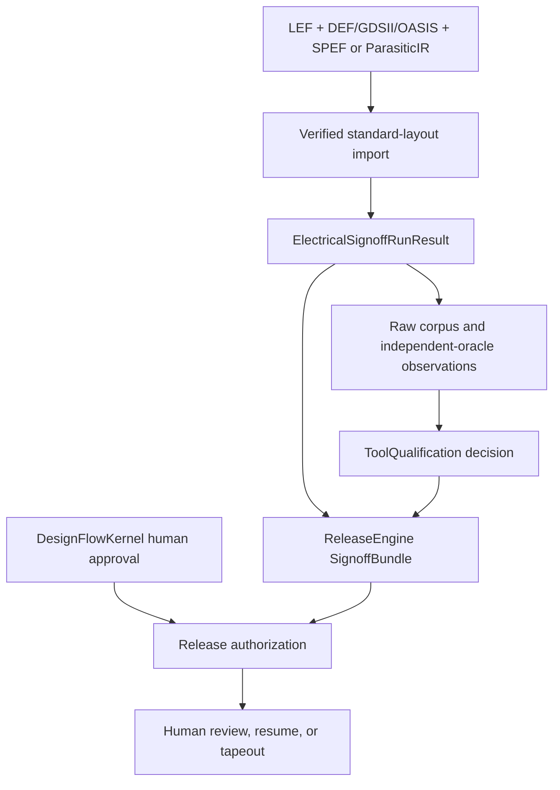

# Engine Package Integration

Xcircuite composes independent domain engines into a persistent design flow.

Domain packages own their algorithms, typed requests, typed results,
diagnostics, and raw evidence. Xcircuite owns the concrete `.xcircuite`
workspace and the `FlowStageExecutor` implementations that connect those
domain protocols to `DesignFlowKernel`.

Every concrete stage executor conforms directly to
`DesignFlowKernel.FlowStageExecutor` and invokes the public protocol of its
domain package. No additional runtime protocol, wrapper result, facade, or
re-export is part of this contract.

## Ownership

| Owner | Responsibility |
|---|---|
| `CircuiteFoundation` | Artifact identity, role, kind, format, digest, byte count, diagnostics, evidence, and execution provenance |
| Domain package | Domain request, execution protocol, algorithm, typed result, diagnostics, and raw observations |
| `ToolQualification` | Tool descriptors, retained-evidence reconstruction, capability and trust decisions, and known limitations |
| `DesignFlowKernel` | Stage lifecycle, trust requirements, retry, approval, waiver, cancellation, review, and resume |
| `Xcircuite` | Project-root-bound storage, artifact resolution, stage construction, concrete ledger persistence, and engine composition |
| `ReleaseEngine` | Fail-closed signoff aggregation, tapeout packaging, and final release authorization |
| `circuit-studio` | Human review and intervention over the same ledger and artifacts |

## Dependency rule

Domain packages depend on CircuiteFoundation and their explicit domain
dependencies. They do not depend on Xcircuite or circuit-studio. Xcircuite
depends on the published domain products it composes, and circuit-studio depends
on Xcircuite to present the retained ledger and artifacts.

## Stage execution contract

A stage executor resolves and verifies inputs, builds the domain request,
invokes one injected domain protocol, persists the typed result and Foundation
artifacts, maps diagnostics into `FlowStageResult`, and binds the result to the
design, PDK, tool, and execution provenance.

The PDK standard-view and rule-deck stages additionally expose an explicit
external-process provider. `PDKExternalInspectionProcessConfiguration` is carried
in the agent-facing runtime spec, `TimedPDKExternalInspectionProcessRunner`
uses `SignoffToolSupport` for timeout and cancellation-aware execution, and the
provider persists request/result/stdout/stderr/execution artifacts under the
run stage before `PDKKit` validates the typed result. This boundary is
process execution and evidence retention, not tool qualification: the
`ToolQualification` descriptor and any independent process evidence remain a
separate trust gate.

## Stage registration

`XcircuiteEnginePackageCatalog` is the machine-readable inventory of domain
package products, stage IDs, and input/output artifact roles. A stage change is
complete only when the catalog, runtime construction, and integration tests
agree.

| Domain package | Xcircuite stage family |
|---|---|
| `PDKKit` | discovery, validation, corpus, standard-view inspection, oracle comparison |
| `LogicDesign` | elaboration and power intent |
| `LogicEngine` | lowering, functional simulation, synthesis, and equivalence |
| `RTLVerificationEngine` | lint, CDC, RDC, and formal equivalence |
| `DFTEngine` | scan insertion, ATPG, and BIST |
| `PhysicalDesignEngine` | floorplan, placement, power, CTS, routing, ECO, antenna, DFM, repair, and review |
| `TimingEngine` | STA and signal-integrity analysis |
| `ElectricalSignoffEngine` | standard-layout import, electrical axes, corpus observations, and repair revisions |
| `ReleaseEngine` | authorization, signoff bundle generation, and tapeout handoff |

`RTLVerificationEngine` is registered as `rtl.lint`, `rtl.cdc`, `rtl.rdc`, and
`rtl.equivalence`. `RTLVerificationFlowStageExecutor` resolves digest-bearing
RTL, reference, and optional SDC inputs; invokes the native or injected
`RTLVerificationExecuting` protocol; and persists the typed result and proof
artifacts. Oracle execution produces raw correlation evidence. ToolQualification
alone evaluates the retained evidence and issues a trust decision.

DRC, LVS, PEX, layout-command, CoreSpice simulation, and post-layout comparison
executors use the same direct `FlowStageExecutor` contract even though they are
not entries in the engine-package scaffold catalog.

ElectricalSignoffEngine is registered for standard-layout import, electrical
analysis, corpus observation, and repair-revision stages.
`ElectricalStandardLayoutImportFlowStageExecutor` converts verified standard
inputs into a canonical physical snapshot. `ElectricalSignoffFlowStageExecutor`
persists the canonical run result and Foundation evidence. Corpus execution
persists raw measurements and independent-oracle observations for
ToolQualification. `ElectricalSignoffRepairRevisionFlowStageExecutor` applies a
provenance-checked repair candidate to a new revision. DesignFlowKernel owns
approval and resume; ReleaseEngine owns release authorization.

## Electrical signoff path

Geometry without explicit routed electrical connectivity remains blocked.
Xcircuite persists the electrical result, repair candidates, signoff bundle,
trust inputs, and approval references as separate immutable artifacts so no
domain result can approve or qualify itself.

PhysicalDesignEngine also exposes `PhysicalDesignReviewFlowStageExecutor` as
the Xcircuite human-review boundary. It persists the native immutable review
packet under the run stage, lets `DesignFlowKernel` record the approval, and
re-validates the packet manifest and referenced artifact digests before the same
run resumes through the flow-owned approval contract. `PhysicalDesignArtifactReviewValidator`
only validates domain artifacts; it does not own approval, resume, or release
authorization. This retained boundary proves review-artifact integrity; it
remains separate from DRC/LVS/PEX, timing, external-oracle correlation, and
process qualification.

## Completion evidence

A package integration is complete only when it can be executed headlessly,
retains canonical inputs and outputs, exposes typed failure reasons, survives
artifact integrity checks, and can participate in review and resume without UI
state becoming authoritative.

The current retained Xcircuite workspace verification executed 571 tests from
the current Xcircuite HEAD with all eight declared shards passing. That result
proves package-integration behavior; it is not foundry, process, or tool
qualification evidence.
