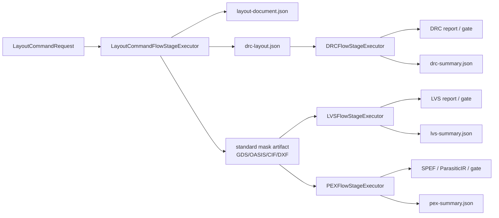
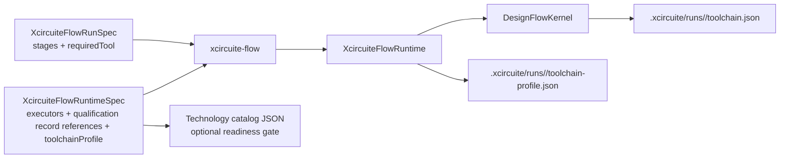

# Xcircuite

## Límite de almacenamiento (Storage boundary)

`XcircuiteWorkspaceStore` es el límite de sistema de archivos concreto para el directorio `.xcircuite` local del proyecto. Cada instancia de actor está vinculada exactamente a una raíz de proyecto normalizada; las llamadas al protocolo que lleven otra raíz fallarán con un error tipado. Las ubicaciones persistidas de `ArtifactReference` utilizan rutas `.xcircuite/...` relativas al proyecto, mientras que `DesignFlowKernel` permanece ajeno al directorio concreto. El almacén rechaza el recorrido (traversal), las ubicaciones de artefactos absolutas, los enlaces simbólicos del espacio de trabajo y los escapes de enlaces simbólicos intermedios. Los artefactos inmutables y las actualizaciones de comparación y sustitución (compare-and-swap) del libro de registro de ejecuciones (run-ledger) versionado se serializan mediante un bloqueo de archivo atómico. La semántica de ciclo de vida y aprobación del flujo permanecen en `DesignFlowKernel`. Las lecturas rutinarias del ciclo de vida cargan metadatos validados del libro de registro sin forzar un escaneo de artefactos de toda la ejecución. La reanudación, la autenticación de aprobación, la autorización de lanzamiento y las rutas de auditoría explícitas utilizan `loadAttestedRunLedger(runID:)`, que primero recupera las transacciones pendientes y luego verifica las proyecciones canónicas, las proyecciones de decisión y cada artefacto retenido.

La evidencia de ejecución terminal es inmutable. El trabajo de revisión humana y planificación realizado después de la finalización se conserva como artefactos propiedad de la acción: primero se prepara el contenido, luego los bytes del artefacto, el registro de la acción, las proyecciones de decisión, la revisión del manifiesto de ejecución y el manifiesto del proyecto se confirman en una única transacción del espacio de trabajo. Las salidas de planificación de nombre fijo y los diferenciales de diseño se redirigen a instantáneas direccionadas por digest (hash) con registros deterministas de `planning.captureArtifact`. La retroalimentación de planes rechazados se conserva como instantáneas inmutables acumulativas, por lo que las iteraciones de planificación posteriores no invalidan los digests de acciones anteriores.

Xcircuite es el tiempo de ejecución (runtime) central sin interfaz (headless) de la plataforma de diseño de semiconductores LSI. Proporciona el flujo consciente del proyecto, la CLI, la integración del libro de registro de artefactos, la calificación de herramientas y la superficie de planificación operable por Agentes utilizada tanto por `circuit-studio` como por llamadores sin interfaz de usuario.

El tiempo de ejecución del proyecto `.xcircuite` es el límite de composición entre `DesignFlowKernel` y los paquetes del motor (engine packages). Los ejecutores de etapa invocan protocolos de dominio directamente y proyectan sus resultados tipados en registros de flujo, puertas y artefactos persistidos. La lógica de veredicto de dominio y los analizadores (parsers) permanecen en los paquetes del motor; el proveedor de inspección externa de PDK explícito es el límite de proceso controlado, utilizando `SignoffToolSupport` y conservando la evidencia de proceso raw antes de que `PDKKit` valide el resultado tipado.

`XcircuiteEnginePackageDescriptor` expresa roles de entrada y salida con el token abierto `ArtifactRole` de CircuiteFoundation. Por lo tanto, el descubrimiento de paquetes comparte el mismo contrato de rol semántico validado que cada `ArtifactReference` persistido; las cadenas de texto raw no son un esquema de artefactos paralelo.

## Licencia

Xcircuite tiene el código fuente disponible bajo la [Xcircuite Commercial License 1.0](LICENSE). El repositorio público otorga únicamente Uso de Evaluación. El uso en producción, la integración en productos comerciales, el despliegue orientado al cliente, la redistribución y la sublicencia requieren un Acuerdo de Licencia Comercial por escrito independiente con 1amageek.

Consulte [el modelo de licenciamiento](docs/licensing.md) para ver la matriz de derechos y la distinción entre el código de Xcircuite y los Componentes de Terceros.

## Arquitectura Paraguas (Umbrella architecture)

[`Xcircuite`](https://github.com/1amageek/Xcircuite) es el runtime paraguas para la plataforma de diseño de semiconductores local-first. Los paquetes a continuación siguen siendo utilizables independientemente y poseen sus propios contratos de dominio; Xcircuite los compone a través de ejecutores de etapa tipados, referencias de artefactos, puertas de confianza y el libro de registro de ejecuciones `.xcircuite`.

| Paquete | Responsabilidad | Repositorio |
|---|---|---|
| `CoreSpice` | Simulación SPICE en proceso y análisis de formas de onda | [CoreSpice](https://github.com/1amageek/CoreSpice) |
| `semiconductor-layout` | IR de diseño (Layout), edición, colocación/enrutamiento y preparación nativa de DRC | [semiconductor-layout](https://github.com/1amageek/semiconductor-layout) |
| `swift-mask-data` | E/S de datos de máscara GDSII/OASIS/LEF/DEF/CIF/DXF | [swift-mask-data](https://github.com/1amageek/swift-mask-data) |
| `DRCEngine` | Ejecución de DRC nativo y externo, diagnósticos y artefactos | [DRCEngine](https://github.com/1amageek/DRCEngine) |
| `LVSEngine` | Ejecución de LVS nativo y externo, emparejamiento y evaluación | [LVSEngine](https://github.com/1amageek/LVSEngine) |
| `PEXEngine` | Extracción parasítica, `ParasiticIR` canónico y artefactos PEX | [PEXEngine](https://github.com/1amageek/PEXEngine) |
| `ToolQualification` | Capacidad de la herramienta, salud, evidencia y puertas de confianza | [ToolQualification](https://github.com/1amageek/ToolQualification) |
| `DesignFlowKernel` | Ciclo de vida de la etapa, reintentos, aprobaciones y reanudación | [DesignFlowKernel](https://github.com/1amageek/DesignFlowKernel) |
| `SignoffToolSupport` | Descubrimiento de PDK y ejecución segura de procesos externos | [SignoffToolSupport](https://github.com/1amageek/SignoffToolSupport) |

## Desarrollo

Xcircuite se distribuye como una biblioteca de Swift Package Manager y expone la biblioteca `Xcircuite` junto con la herramienta de línea de comandos `xcircuite-flow`. Utilice el manifiesto del paquete como la fuente de verdad para la resolución de dependencias. Construya con `swift build`; ejecute las pruebas del paquete Swift a través del esquema de Xcode `Xcircuite-Package` con límite de tiempo. El paquete no requiere una sesión de interfaz de usuario ni una disposición de checkout específica del proyecto. Xcircuite está disponible públicamente en <https://github.com/1amageek/Xcircuite>.

## Ejecutores de etapa (Stage executors)

| Tipo | Responsabilidad |
|---|---|
| `LogicElaborationFlowStageExecutor` / `PowerIntentFlowStageExecutor` / `LogicLoweringFlowStageExecutor` / `LogicSimulationFlowStageExecutor` | Ejecuta la tubería (pipeline) de lógica nativa desde la fuente y UPF/CPF a través de una instantánea canónica y un diseño de ejecución reducido; el modo de entrada directa consume el artefacto vinculado al digest de la etapa anterior sin generar solicitudes de entrega mutables |
| `PhysicalDesignFlowStageExecutor` | Ejecuta una solicitud de diseño físico tipada para una etapa explícitamente permitida y conserva los artefactos inmutables y diagnósticos del motor sin promover la ejecución de geometría-smoke a P&R de producción |
| `LayoutCommandFlowStageExecutor` | Aplica solicitudes de `LayoutCommands` reproducibles a través del protocolo público `LayoutCommandRunning` de LayoutCommands, verifica cada artefacto declarado por el ejecutor contra sus bytes, digest, recuento de bytes y productor de evidencia, normaliza la ubicación a rutas relativas al espacio de trabajo sin perder el linaje del productor, y puede emitir JSON compatible con DRC más exportaciones de diseño estándar para etapas DRC/LVS/PEX posteriores |
| `DRCFlowStageExecutor` | Resuelve y verifica las entradas exactas de DRC, persiste una solicitud tipada inmutable y un resultado de ejecución canónico vinculado al productor reemplazable por reintentos, indexa `drc-summary`, emite canales de evaluación de violaciones y verifica el productor del manifiesto más la integridad de la salida antes del éxito de la etapa |
| `LVSFlowStageExecutor` | Resuelve y verifica las entradas exactas de LVS, persiste una solicitud tipada inmutable y un resultado de ejecución canónico vinculado al productor reemplazable por reintentos, indexa `lvs-summary`, y verifica el productor del manifiesto más la integridad de la salida antes del éxito de la etapa |
| `PEXFlowStageExecutor` | Ejecuta PEX a través de `PEXEngine`, expone una fábrica de producción explícita para el backend real de Magic, indexa artefactos de extracción y `pex-summary` como `ArtifactReference`s, y bloquea la infraestructura no disponible sin fabricar una salida de signoff |
| `DFTFlowStageExecutor` / `DFTOracleCorrelationFlowStageExecutor` | Ejecuta solicitudes de DFT tipadas y correlaciona casos de oráculo retenidos en observaciones raw vinculadas a la solicitud |
| `ProcessQualificationEvidenceBuilderFlowStageExecutor` | Construye evidencia de proceso propiedad de ToolQualification a partir de grupos de artefactos retenidos independientemente |
| `SimulationFlowStageExecutor` | Ejecuta la simulación SPICE a través del contrato canónico `CoreSpiceSimulationResult`, vincula su procedencia a la entrada de netlist persistida, conserva el productor exacto en los artefactos de forma de onda/medición/resultado, emite una envolvente de evaluación a nivel de ejecución y aplica puertas basadas en expectativas de medición más integridad de artefactos |
| `PostLayoutComparisonFlowStageExecutor` | Resuelve referencias exactas de artefactos de formas de onda pre/post, las conserva en la procedencia de comparación y persiste el informe canónico seguro para reintentos con la identidad del productor de comparación |
| `TimingSTAFlowStageExecutor` / `TimingSIFlowStageExecutor` | Invocan protocolos de TimingEngine directamente y resuelven cada entrada de diseño, biblioteca, restricción, PDK y parasítica a través de la infraestructura de flujo inyectada antes del análisis |
| `PDKDiscoveryFlowStageExecutor` / `PDKValidationFlowStageExecutor` | Descubren y validan PDKs vinculados al manifiesto, reenvían la identidad de activos requerida para producción y la política de esquina bloqueada a PDKKit, luego persisten el resultado tipado a través del límite de transacción del espacio de trabajo con el productor de ejecución de dominio retenido en el artefacto, el libro de registro y el manifiesto de ejecución |
| `PDKCorpusValidationFlowStageExecutor` / `PDKOracleFlowStageExecutor` | Ejecutan contratos de comparación de oráculo y corpus retenido, preservan la semántica de bloqueo/fallo y conservan la procedencia del resultado como evidencia de ejecución segura para reintentos |
| `PDKStandardViewInspectionFlowStageExecutor` / `PDKRuleDeckInspectionFlowStageExecutor` | Inspeccionan vistas estándar y rule decks vinculados al manifiesto localmente o a través del proveedor de proceso externo tipado, persisten evidencia de resultado segura para reintentos con su identidad de productor medida, y preservan diagnósticos de contrato bloqueado/fallido |
| Etapa de corpus eléctrico | Persiste el corpus raw y las observaciones de oráculo independiente para ToolQualification sin emitir confianza |
| `PhysicalDesignReviewFlowStageExecutor` | Persiste un paquete de revisión de diseño físico inmutable, registra la puerta de aprobación genérica y delega la validación de integridad de artefactos revisados a `PhysicalDesignArtifactReviewValidator` |
| `ReleaseAuthorizationFlowStageExecutor` | Compone ReleaseEngine con el almacén de espacio de trabajo vinculado al proyecto para lecturas de artefactos verificadas y autenticación de aprobación de libro de registro canónico atestiguado; ReleaseEngine en sí mismo permanece independiente del diseño del almacenamiento |

La inspección externa de PDK se selecciona agregando `externalProcess` a un ejecutor de tiempo de ejecución `pdkStandardView` o `pdkRuleDeck` etiquetado. La configuración se valida antes de la construcción del runtime, expande solo los marcadores de posición documentados de solicitud, resultado, proyecto, ejecución y activo, ejecuta la ruta del ejecutable canónico medido, redacta posiciones de argumentos sensibles configuradas de los registros y procedencia retenidos, y escribe artefactos en `.xcircuite/runs/<run-id>/stages/<stage-id>/raw/external-pdk/` para la solicitud, el resultado, stdout, stderr y el registro de ejecución. El resultado del proceso sigue sujeto al esquema de `PDKKit`, ejecución, activo, formato, referencia de fuente y validación vinculada al digest; la finalización del proceso por sí sola nunca promueve la confianza de la herramienta o la calificación del proceso.

La ejecución de DFT y la correlación de oráculo utilizan casos de tiempo de ejecución distintos `dftExecution` y `dftOracleCorrelation`. Las etapas de DFT producen resultados raw y observaciones de correlación. Las mutaciones de escaneo/BIST completadas se aceptan solo después de que el verificador semántico de DFTEngine vuelva a abrir los artefactos canónicos de la fuente y los transformados y valide la estructura retenida; el ATPG adicionalmente reproduce cada patrón detectado con el verificador nativo a nivel de puerta. El ensamblaje de evidencia de lanzamiento utiliza ese mismo verificador en lugar de duplicar la semántica de DFT. Los resultados eléctricos completados deben conservar la cobertura exacta esperada/analizada de entidades canónicas; los resultados bloqueados y fallidos siguen siendo revisables pero no pueden convertirse en evidencia de lanzamiento aprobada. Una etapa separada de `processQualificationEvidenceBuild` utiliza ToolQualification para construir evidencia de proceso; ninguna de estas etapas emite elegibilidad de lanzamiento. `ReleaseEngine` consume evidencia de signoff validada y `DesignFlowKernel` es el dueño de la aprobación, la exención (waiver), la revisión y la reanudación.



`drc-layout.json` se produce solo cuando la especificación del runtime incluye `LayoutCommandDRCExportSpec`. El adaptador mantiene esto como una preocupación del flujo: `LayoutCommands` muta los documentos de diseño, mientras que `DRCEngine` evalúa las reglas. Cuando se proporciona `drcExport.viaDefinitions`, las vías de los comandos de diseño se expanden en rectángulos de capa de corte DRC con IDs de red preservados. Las etapas de DRC posteriores deben consumir este archivo a través de `XcircuiteFlowInputReference.stageArtifact` con el ID de artefacto `drc-layout`, para que las configuraciones de tiempo de ejecución no integren un ID de ejecución específico y el digest del artefacto registrado se verifique antes de que se ejecute el DRC.

Las exportaciones de diseño estándar se producen cuando la especificación del runtime incluye `LayoutCommandStandardLayoutExportSpec`. La exportación utiliza `LayoutIO` y `LayoutTechDatabase` para escribir artefactos GDSII/OASIS/CIF/DXF con IDs de artefactos estables como `layout-gds`, `layout-oasis`, `layout-cif` o `layout-dxf`. Las etapas de LVS posteriores consumen artefactos GDSII/OASIS/CIF/DXF a través de `XcircuiteFlowInputReference.stageArtifact`; las etapas de PEX consumen la entrega de GDSII/OASIS actualmente soportada de la misma manera. Las netlists de fuente PEX y el JSON de tecnología también pueden proporcionarse a través de referencias de entrada tipadas, lo que mantiene la entrega de artefactos con alcance de ejecución separada de la lógica de extracción específica del motor.

El LVS de diseño estándar nativo se rige por perfiles. Su perfil de extracción propiedad del proceso, la fuente (deck) y el ID del perfil de proceso son entradas de tiempo de ejecución explícitas; el esquema del perfil, la cobertura semántica, la identidad y el digest de la fuente se verifican antes de la extracción de geometría. Pueden declararse por etapa o suministrarse juntos mediante el perfil de la cadena de herramientas (toolchain) a nivel de ejecución.

Las configuraciones de tiempo de ejecución también pueden declarar un `XcircuiteFlowToolchainProfile` en el nivel superior. El perfil registra la procedencia del PDK/catálogo, las entradas de tecnología predeterminadas de DRC/LVS/PEX y el conjunto de artefactos de extracción LVS nativo para las etapas de signoff. Los campos locales de la etapa anulan el perfil, pero las etapas que los omiten pueden compartir el mismo perfil a nivel de ejecución en lugar de duplicar rutas en cada ejecutor.

Cada etapa de PEX exitosa escribe `pex-summary.json` con el ID de artefacto estable `pex-summary`. El archivo es un `PEXRunSummaryReport` generado a partir del manifiesto de PEX y los artefactos ParasiticIR, para que la revisión de Agente / CI / Humano pueda inspeccionar las redes parasitas principales por esquina desde el libro de registro de ejecuciones `.xcircuite` sin volver a ejecutar PEX o analizar logs.

`PEXFlowStageExecutor.production(...)` selecciona `DefaultPEXEngine.withDefaults()` y el backend real nombrado por `PEXBackendSelection`. Magic y OpenRCX conservan la versión del ejecutable medida y la identidad SHA-256 en la procedencia canónica; la etapa rechaza un productor que difiera de su ID de herramienta `pex-<backend>` o de un productor esperado configurado explícitamente. Un ejecutable, PDK o deck de extracción no disponible se conserva como evidencia de fallo tipada `adapterUnavailable` y se mapea a una etapa de flujo bloqueada; no produce un artefacto de signoff `pex-summary`. Los extractores con alcance de prueba se inyectan directamente en `PEXFlowStageExecutor` desde el objetivo de prueba y no forman parte de la especificación de tiempo de ejecución pública.

Las etapas de PEX también escriben una envolvente de evidencia `pex-summary` vinculada al productor. La envolvente expande `PEXRunSummaryReport` en canales de observación legibles por el Agente para la completitud de artefactos, recuento de esquinas fallidas, recuento total de redes/elementos, capacitancia total de tierra y acoplamiento, resistencia total, presencia de ParasiticIR/SPEF por esquina y valores parasitas de la red principal por esquina. Los huecos de completitud se dirigen a `structureMapping`; las señales de la red principal dominante permanecen en `localSurface` para que un Agente pueda decidir si el siguiente paso es la reparación de la extracción o la comparación de métricas post-layout.

Cada etapa de DRC y LVS también escribe un artefacto de revisión compacto. `drc-summary.json` utiliza el ID de artefacto estable `drc-summary` y almacena un `DRCRunSummaryReport`. `lvs-summary.json` utiliza el ID de artefacto estable `lvs-summary` y almacena un `LVSRunSummaryReport`. Estos resúmenes exponen el estado, los recuentos de errores activos/exentos, los remanentes de exenciones y los grupos de violaciones/desajustes, mientras que el informe completo del motor sigue siendo la fuente de diagnóstico detallada.

Las etapas de DRC también escriben `evidence/drc-summary-envelope.json`. La envolvente expande `DRCRunSummaryReport` en canales de observación legibles por el Agente como `drc-active-violation-count`, `drc-violation-bucket-count`, `drc-rule-<index>-<rule>-active-count` por regla, recuentos de formas/redes relacionadas y canales de sugerencias de corrección. Los grupos de DRC fallidos dirigen la retroalimentación a `localSurface` con acciones de planificación de reparación, mientras que la evidencia de herramienta faltante y la calibración no calificada permanecen como estados de observación explícitos en lugar de texto de log oculto. La calibración calificada requiere además una calificación de proceso retenida actual cuyo identificador de implementación, versión de herramienta y digest binario coincidan exactamente con el identificador del productor de ejecución, la versión y la construcción medida.

Las etapas de LVS escriben similarmente `evidence/lvs-summary-envelope.json`. La envolvente expande `LVSRunSummaryReport` en `lvs-active-mismatch-count`, `lvs-mismatch-bucket-count`, `lvs-mismatch-<index>-<rule>-active-count` por grupo, recuento de diseño/esquemático, puerto, modelo, parámetro, política de dispositivo y canales de sugerencia de corrección. La retroalimentación dirige los desajustes locales de netlist/diseño a `localSurface`, mientras que los desajustes de política/equivalencia se dirigen a `structureMapping` para que la planificación de reparación del Agente pueda elegir la superficie de edición correcta.

Antes de que los resultados de las etapas DRC/LVS/PEX se persistan, Xcircuite verifica cada artefacto de salida indexado de la etapa con `LocalArtifactVerifier`. El resultado de la etapa contiene una puerta de `artifact-integrity` para contención del proyecto, contención de enlaces simbólicos, SHA-256 y recuento de bytes. Las etapas DRC y LVS también contienen puertas `drc-artifacts` / `lvs-artifacts` que decodifican el manifiesto de artefactos del motor y prueban que cada salida declarada esté indexada en `FlowStageResult.artifacts`. PEX mantiene `pex-artifacts` para la completitud del dominio y añade `pex-flow-artifacts` para la cobertura del libro de registro de flujo del manifiesto PEX persistido. Un resultado del motor DRC/LVS/PEX solo puede hacer que la etapa tenga éxito cuando su puerta de dominio y sus puertas de artefactos pasen. Esto mantiene los artefactos del libro de registro de ejecución, los paquetes de revisión humana y las entradas `stageArtifact` posteriores bajo el mismo contrato de manifiesto e integridad.

## Tiempo de ejecución del flujo (Flow runtime)

`XcircuiteFlowRuntimeSpec` es la configuración de tiempo de ejecución legible por máquina utilizada por los llamadores de Agente / CLI / CI. Declara los ejecutores de etapa que pueden utilizarse para una ejecución, los descriptores de herramientas en proceso, el estado de salud y la evidencia de confianza. La especificación del runtime es consumida por `xcircuite-flow run` y `xcircuite-flow resume-run`; no introduce un envoltorio (wrapper) de Agente.

El contrato JSON versionado está documentado en [`docs/flow-runtime-schema.md`](docs/flow-runtime-schema.md).



| Tipo | Responsabilidad |
|---|---|
| `XcircuiteFlowRunSpec` | ID de ejecución, intención, definiciones de etapa y `ToolTrustRequirement`s |
| `XcircuiteFlowRuntimeSpec` | Configuración del ejecutor, referencias opcionales a artefactos `ToolQualificationRecord` y perfil de signoff opcional a nivel de ejecución |
| `XcircuiteFlowToolchainProfile` | Procedencia de PDK/catálogo y entradas de tecnología DRC/LVS/PEX predeterminadas para ejecuciones de signoff compartidas |
| `XcircuiteFlowTechnologyCatalog` | Contrato de preparación respaldado por catálogo para emparejar IDs de PDK/catálogo del perfil y archivos de tecnología locales requeridos |
| `XcircuiteFlowTechnologyCatalogInventory` | Informe de inventario orientado al Agente para el descubrimiento de la raíz del PDK, entradas del catálogo, resolución de archivos requeridos y activos de PDK/catálogo faltantes |
| `XcircuiteFlowToolSpec` | `ArtifactReference` opcional vinculado al digest a un `ToolQualificationRecord` emitido fuera del Motor |
| `XcircuiteFlowRuntime` | Ejecuta a través de `DesignFlowKernel`; la reanudación primero carga un libro de registro atestiguado por artefactos y se detiene antes de la ejecución si falta o ha cambiado cualquier artefacto retenido |

`xcircuite-flow validate --project-root <path> --runtime-config <path>` controla la preparación del perfil respaldada por el catálogo antes de la ejecución: IDs de perfil, emparejamiento de PDK/catálogo, listas de permitidos del perfil, rutas seguras y existencia de archivos requeridos. `xcircuite-flow inspect-toolchain-profile --runtime-config <path> [--project-root <path>]` devuelve el mismo estado de preparación como JSON sin lanzar un error ante la falta de preparación, para que los llamadores de Agente / CI puedan inspeccionar los archivos de PDK/catálogo faltantes y decidir la siguiente acción. `xcircuite-flow inspect-technology-catalog --catalog-path <path> [--project-root <path>]` enumera las entradas del catálogo y el estado de los archivos requeridos directamente. También puede leer `toolchainProfile.technologyCatalogPath` desde `--runtime-config`, y `--pdk-root <path>` realiza un descubrimiento de catálogo limitado bajo una raíz de PDK local. Los archivos requeridos relativos se resuelven primero desde el directorio del catálogo y luego desde las raíces de PDK declaradas, para que los llamadores del Agente puedan comparar un perfil de runtime contra el inventario de PDK local más amplio antes de seleccionar un perfil de signoff.

El límite de revisión de diseño físico es intencionadamente más estrecho que el de signoff. Prueba la revisión de manifiesto inmutable, la vinculación de aprobación humana, el re-hash de artefactos y la reanudación de la misma ejecución; no reclama calificación de DRC, LVS, PEX, timing, fundición o proceso. La regresión retenida de Xcircuite cubre este límite a través de `PhysicalDesignFlowStageExecutorTests/physicalReviewApprovalResumesFlow`.

La prueba retenida `EndToEndDesignFlowTests/retainedMultiEngineRunResumesAfterReview` ejecuta adicionalmente una ejecución a través de elaboración de SystemVerilog, reducción (lowering), simulación lógica, STA de timing, planificación física (floorplanning), materialización de diseño, DRC/LVS nativo, una etapa PEX, integridad del paquete de revisión, aprobación humana y reanudación de la misma ejecución. La reducción lógica consume el artefacto de elaboración, la simulación lógica consume el artefacto reducido y el DRC consume el artefacto de diseño materializado; la prueba afirma los digests del productor en las procedencias/manifiestos posteriores. Esta es la evidencia de integración para la ruta de entrega actual; la implementación de PEX con alcance de prueba demuestra el contrato de la etapa en lugar del signoff físico, y la ejecución no promueve los resultados locales a una calificación de oráculo externo o de fundición/proceso.

La preparación de la plataforma cubre LogicDesign, LogicEngine, verificación RTL, DFT, diseño físico, STA/SI, signoff eléctrico, lanzamiento y tapeout, además de los dominios de simulación/diseño/DRC/LVS/PEX. Las declaraciones de operación por sí solas nunca pasan un hito: se requieren registros de ejecución de xcodebuild retenidos, integridad de artefactos, procedencia de ejecución y puertas de etapa. La evidencia de `production-qualified-release-flow` sigue siendo obligatoria y no es proporcionada por pruebas de fixture o de etapas bloqueadas, por lo que una ejecución de smoke local no puede reportarse como lista para producción.

Los motores emiten valores `ObservationRecord` raw. Los evaluadores específicos de dominio derivan evaluaciones tipadas de esas observaciones. `ToolQualification` verifica independientemente las observaciones y evaluaciones retenidas antes de emitir un `ToolQualificationRecord` canónico. Xcircuite recibe solo una `ArtifactReference` vinculada al digest a ese registro. Una etapa de ejecución puede requerir la evidencia calificada del registro a través de `ToolTustRequirement.requiredQualifiedEvidenceKinds`. Durante la construcción del runtime, `ToolQualification` vuelve a calcular el hash del registro y su evidencia retenida, luego verifica la identidad de la herramienta, el emisor, la marca de tiempo, el alcance y las decisiones de emisión. Los registros faltantes, obsoletos, no canónicos o discordantes se bloquean en la puerta de `tool-trust` y se persisten en `toolchain.json`. Las configuraciones de runtime se validan antes de la construcción del runtime y la adjunción de evidencia: la lista de ejecutores debe ser no vacía, los `stageID` de los ejecutores deben ser identificadores válidos de Xcircuite, se rechazan los IDs de etapa de ejecutor duplicados, y los perfiles de cadena de herramientas presentes deben pasar la validación de preparación para identificadores estables de perfil / PDK / catálogo más referencias tecnológicas seguras. Utilice `inspect-toolchain-profile` cuando se necesite un informe de preparación estructurado sin convertir la falta de preparación en un fallo de la CLI. Las especificaciones de ejecución se validan antes de la construcción de la solicitud: la intención y las etapas deben ser no vacías, el `runID` y los IDs de etapa deben ser identificadores válidos de Xcircuite, los nombres de visualización de las etapas deben ser no vacíos y se rechazan los IDs de etapa de ejecución duplicados. Cuando `xcircuite-flow validate` recibe tanto una especificación de ejecución como una configuración de runtime, también verifica que cada etapa de ejecución tenga un ejecutor de runtime.

Las especificaciones de ejecución también llevan una `FlowStageRetryPolicy` por etapa. `DesignFlowKernel` ejecuta el bucle de reintento limitado, mientras que Xcircuite mantiene los diagnósticos del motor lo suficientemente estables para la coincidencia de políticas. Los fallos transitorios de DRC, LVS, PEX y el backend de simulación se normalizan a `DRC_EXECUTION_ERROR`, `LVS_EXECUTION_ERROR`, `PEX_EXECUTION_ERROR` y `SIMULATION_EXECUTION_ERROR`, pueden reintentarse según la política y producen `stages/<stage-id>/attempts.json` más un artefacto de paquete de revisión `stage-attempts`. `XcircuiteFlowRuntimeTests/runtimeRetriesTransientDRCExecutorFailureAndPersistsAttempts`, `SignoffFlowStageExecutorTests/lvsExecutorRetriesTransientFailureAndPersistsAttempts`, `PEXFlowStageExecutorTests/pexExecutorRetriesTransientFailureAndPersistsAttempts` y `SimulationFlowStageExecutorTests/simulationExecutorRetriesTransientFailureAndPersistsAttempts` prueban estas rutas a través del runtime y los límites de etapa respaldados por el motor.

## CLI

```bash
xcircuite-flow run \
  --project-root <project-root> \
  --run-spec <run.json> \
  --runtime-config <runtime.json>

xcircuite-flow resume-run \
  --project-root <project-root> \
  --run-id <run-id> \
  --runtime-config <runtime.json>

xcircuite-flow attach-qualification-record \
  --project-root <project-root> \
  --runtime-config <runtime.json> \
  --stage-id <stage-id> \
  --record-reference <qualification-record-reference.json> \
  --out <runtime-with-record.json>

xcircuite-flow validate \
  --run-spec <run.json> \
  --runtime-config <runtime.json>

xcircuite-flow inspect-platform-capabilities \
  --run-id <run-id> \
  --generated-at <timestamp> \
  --test-evidence <readiness-or-test-evidence.json> \
  --out <readiness-report.json>
```

Los comandos de planificación operan directamente sobre los artefactos de `.xcircuite/runs/<run-id>/planning/`. Proporcionan la superficie de reparación/mejora orientada al Agente sin introducir un envoltorio de Agente.

| Comando | Escribe |
|---|---|
| `inspect-platform-capabilities` | Informe de preparación JSON para hitos de la plataforma: signoff local autónomo, bucle de diseño operable por Agente, revisión/auditoría humana, anclaje de formato estándar y planificación de mejora post-layout; cada hito enumera los dominios requeridos, operaciones, artefactos, puertas de verificación, evidencia de pruebas de regresión, elementos faltantes, operaciones planificadas/parciales y siguientes acciones. La evidencia persistida sin un recibo de ejecutor en proceso no puede promoverse a aprobada; `--test-evidence` acepta un array de evidencia de prueba o un informe de preparación anterior, `--execute-tests` ejecuta y verifica las declaraciones, y `--out` retiene atómicamente el informe de esa invocación. |
| `generate-planning-problem` | `planning/problem.json` a partir de entradas de resumen DRC/LVS/PEX con suposiciones generadas, clasificaciones de riesgo, objetivos, restricciones, acciones candidatas, puertas de verificación y contrato de reanudación |
| `audit-problem-translation` | `planning/problem-translation-audit.json` con cobertura de fuente a objetivo/acción/restricción/meta/puerta, referencias de fuente no cubiertas, elementos de problema huérfanos, diagnósticos bloqueantes y siguientes acciones antes de la ejecución del planificador |
| `validate-planning-problem` | `planning/problem-validation.json` con esquema/referencia, suposición/riesgo, dominio de objetivo/acción, puerta de verificación y diagnósticos de auditoría de traducción recién actualizados antes de la ejecución del planificador |
| `generate-candidate-plan` | Artefactos inmutables direccionados por contenido `planning/generated-candidate-plans/<sha256>.json` y `planning/generated-symbolic-planner-traces/<sha256>.json` a partir de problemas de planificación tipados con suposiciones de pasos seleccionados y clasificaciones de riesgo para revisión; se bloquea cuando la auditoría de traducción recién actualizada es bloqueante |
| `symbolic-planner-feature-matrix` | Matriz de cobertura del planificador simbólico con etiquetas de validación de corpus requeridas, etiquetas de cobertura implementadas/planificadas, referencias de evidencia y trabajo restante; la evaluación del corpus valida las etiquetas de cobertura de suite y casos contra las entradas de la matriz implementadas |
| `export-symbolic-planner-problem` | `planning/symbolic-planner/domain.pddl`, `planning/symbolic-planner/problem.pddl` y `planning/symbolic-planner/pddl-export.json` para planificadores simbólicos externos; se bloquea cuando la auditoría de traducción recién actualizada es bloqueante |
| `run-symbolic-planner-solver` | `planning/symbolic-planner/solver-run.json`, `solver-stdout.txt`, `solver-stderr.txt`, `solver-plan.txt` y `planning/candidate-plan.json` importado desde un proceso de solver PDDL externo con límite de tiempo |
| `validate-symbolic-planner-solver` | `planning/symbolic-planner/solver-validation.json` que contiene la validación del dominio a partir de la acción esperada, cobertura de metas, certificado, prueba y comprobaciones de optimalidad; no emite confianza de herramienta ni calificación |
| `assess-symbolic-planner-solver-corpus` | `.xcircuite/assessments/symbolic-planner/<suite-id>/solver-corpus-assessment-suite.json` más `solver-corpus-assessment.json` con entrada de suite reproducible, etiquetas de cobertura requeridas, tasa de aprobación de múltiples casos y referencias de validación por caso; ToolQualification sigue siendo el único emisor y validador de registros de calificación |
| `import-symbolic-planner-plan` | `planning/symbolic-planner/solver-plan.txt` y `planning/candidate-plan.json` proyectado al riesgo desde un plan de solver externo compatible con PDDL |
| `generate-parameter-candidates` | `planning/parameter-candidates.jsonl` y `planning/parameter-candidate-search-trace.json` a partir de sugerencias de `parameterBounds` limitadas, incluyendo el ordenamiento de `adaptive-bounded-refinement` y `feedback-aware-bounded-refinement` |
| `synthesize-parameter-candidate-plan` | `planning/candidate-plan.json` proyectado al riesgo a partir de un candidato de parámetro limitado seleccionado, omitiendo candidatos rechazados de `planning/rejected-plans.jsonl` a menos que se incluyan explícitamente y devolviendo un rastro de selección de retroalimentación ponderado por `costModel` |
| `approve-candidate-plan-risk` | `.xcircuite/runs/<run-id>/approvals/<approval-id>.json` utilizando el esquema compartido `FlowApprovalRecord` |
| `execute-candidate-plan` | `planning/plan-execution/<sha256>.json` inmutable, artefactos de diseño/netlist producidos, `design-diffs/<sha256>.json` y `actions.jsonl`; el riesgo que requiere aprobación bloquea antes de la mutación del diseño a menos que el registro de aprobación requerido esté aprobado |
| `verify-candidate-plan` | `planning/plan-verification/<sha256>.json` inmutable con estado simbólico, resultados de puertas, `riskReviews`, estado de revisión de aprobación, `planning/rejected-plans.jsonl` para planes rechazados/bloqueados, más artefactos de métricas de DRC/LVS/PEX/simulación post-ejecución cuando existen entradas |
| `run-numeric-repair-loop` | `planning/numeric-repair-loop.json` más instantáneas por iteración bajo `planning/numeric-repair-loop/iterations/` mientras genera candidatos, sintetiza ediciones, ejecuta, verifica y alimenta los candidatos rechazados en la siguiente iteración |
| `assess-verified-improvement-corpus` | `.xcircuite/assessments/verified-improvement/<suite-id>/corpus-suite.json` y `corpus-report.json` con evaluación de resultados tipada de DRC/LVS/PEX/bucle numérico; no emite calificación de herramientas |
| `run-selected-suggested-action` | Carga el registro `review.selectSuggestedAction` listo más reciente, valida su vinculación de ejecución, luego proyecta la operación semántica tipada en la invocación `xcircuite-flow --project-root` de este proyecto y la despacha a través del manejador de CLI tipado; el ID de la siguiente acción padre y el ID de la acción sugerida anidada permanecen como identidades de libro de registro distintas |

`XcircuiteFlowCLISupport` también se publica como un producto de biblioteca para hosts locales confiables como circuit-studio. Un host resuelve `XcircuiteResolvedSuggestedAction` una vez y llama a `XcircuiteFlowCLICommand.dispatchResolvedSuggestedAction(_:)`; la selección de la operación y la persistencia de artefactos siguen siendo propiedad de Xcircuite en lugar de copiarse en la capa de interfaz de usuario.

La ejecución de capacidad de plataforma retenida más reciente es [`ci-artifacts/platform-capability/current-platform-capability-readiness.json`](ci-artifacts/platform-capability/current-platform-capability-readiness.json). Las 15 rutas de prueba declaradas pasaron la validación de recibo, integridad de artefactos, procedencia y estado de salida. El diseño operable por Agente, el anclaje de formato estándar y la mejora post-layout están aprobados para el alcance local probado. El signoff de producción autónomo y la revisión humana permanecen bloqueados únicamente por la evidencia externa de `production-qualified-release-flow`; este informe no convierte la ejecución nativa o sintética en calificación de producción.

`execute-candidate-plan` y `verify-candidate-plan` utilizan el único candidato generado retenido cuando la selección es inequívoca, luego recurren al `planning/candidate-plan.json` canónico. Si existen múltiples candidatos generados inmutables, los llamadores deben seleccionar uno con `--candidate-plan-artifact-id` o `--candidate-plan-path`; no se aplica ninguna recarga implícita al candidato más reciente.

`approve-candidate-plan-risk` primero atestigua cada artefacto de ejecución retenido. Luego selecciona la salida de la acción `planning.verify-candidate-plan` más reciente cuya entrada de acción es la referencia exacta del candidato registrada por esa verificación. La aprobación está vinculada a ese plan candidato decodificado y al artefacto de verificación; un archivo no relacionado con un ID de artefacto familiar, una verificación obsoleta o un artefacto retenido manipulado no pueden autorizar el candidato.

La evidencia de las pruebas de preparación de la plataforma predeterminada utiliza identificadores exactos de prueba de Xcode, incluido el sufijo `()` para los métodos de Swift Testing. Cada comando de evidencia está envuelto por una alarma de 120 segundos y se ejecuta a través de `xcodebuild test`. La evidencia de la CLI de DRCEngine selecciona el objetivo de prueba `DRCCLICoreTests`.

Los artefactos clave para la revisión de confianza son:

```text
<project-root>/.xcircuite/runs/<run-id>/toolchain.json
<project-root>/.xcircuite/runs/<run-id>/toolchain-profile.json
```

Inspéccionelos para confirmar las herramientas seleccionadas/rechazadas, el estado de salud, la evidencia, los resúmenes de corpus/oráculo calificados y el perfil de tecnología de PDK/catálogo utilizado por DRC/LVS/PEX.

## Fixtures de contrato

Los fixtures de especificación de runtime/ejecución confirmados viven bajo `Tests/XcircuiteTests/Fixtures/FlowRuntime/`.

| Fixture | Propósito |
|---|---|
| `qualified-evidence-run.json` | Especificación de ejecución cuya etapa de DRC requiere `requiredQualifiedEvidenceKinds: ["corpus"]` más `maximumEvidenceAgeSeconds` |
| `qualified-signoff-run.json` | Especificación de ejecución cuyas etapas de DRC/LVS/PEX requieren evidencia de corpus calificada |

Regresión:

```bash
xcodebuild -scheme Xcircuite-Package -destination 'platform=macOS' \
  -only-testing:XcircuiteTests/XcircuiteQualificationRecordIntegrationTests \
  -test-timeouts-enabled YES -maximum-test-execution-time-allowance 60 test
```

## Costuras del motor (Engine seams)

| Protocolo | Implementación |
|---|---|
| `DRCExecuting` / `LVSExecuting` / `PEXExecuting` | Implementación del motor de dominio inyectada directamente en el ejecutor de la etapa |
| `SimulationExecuting` | `CoreSpiceSimulationEngine` — ejecuta CoreSpice en proceso, ejecuta los `.op` / `.dc` / `.ac` / `.tran` / `.noise` / `.tf` / `.sens` / `.pz` / `.four` / `.mc` de la netlist, evalúa los resultados de `.measure` y persiste artefactos CSV de estadísticas reales, complejas o de Monte Carlo sin sustituir silenciosamente un análisis diferente |

La puerta de simulación compara las `SimulationMeasurementExpectation`s declaradas (nombre / objetivo / tolerancia) contra los resultados de `.measure` de la netlist; una medición esperada faltante es un fallo (`SIMULATION_MEASUREMENT_MISSING`), no un aprobado. Las comprobaciones de regresión de forma de onda dorada están disponibles a través de `SimulationGoldenComparisonService` y `xcircuite-flow compare-simulation-golden`, produciendo un informe JSON con cobertura de variables requeridas, deltas a nivel de variable, peores puntos, política de interpolación y violaciones de puerta. La evaluación del corpus de simulación registrada está disponible a través de `SimulationGoldenCorpusRunner` y `xcircuite-flow assess-simulation-golden-corpus`, que ejecutan netlists SPICE, comparan las formas de onda producidas contra líneas base CSV doradas y conservan artefactos de forma de onda candidata / comparación por caso como valores `ArtifactReference` canónicos con etiquetas de cobertura. El informe del corpus no define su propia forma de referencia de artefactos. Los artefactos predeterminados se almacenan bajo `.xcircuite/assessments/simulation-golden/<suite-id>/`. Esta representación canónica es la versión 2 del esquema del informe del corpus dorado de simulación.

## Tipos de soporte

| Tipo | Responsabilidad |
|---|---|
| `SignoffToolDescriptors` | Descriptores de herramientas para comandos de diseño, backends nativos de DRC/LVS, simulación CoreSpice y backends de PEX |
| `StageArtifactReferenceBuilder` | Construye `ArtifactReference`s para las salidas de la etapa (ID del artefacto, ruta, tipo, formato, digest) |
| `XcircuiteRuntimeError` | Fallos de tiempo de ejecución tipados |

## Construcción y prueba

```bash
swift build
perl -e 'alarm 420; exec @ARGV' xcodebuild test \
  -scheme Xcircuite-Package \
  -destination 'platform=macOS' \
  -only-testing:XcircuiteTests/<FocusedSuite>
```

Utilice suites enfocadas mientras itera y la matriz de fragmentos del repositorio antes del lanzamiento. Los recuentos de pruebas históricos no son evidencia actual. Una matriz limitada aprobada es evidencia de integración del paquete, no una calificación de fundición o proceso.
