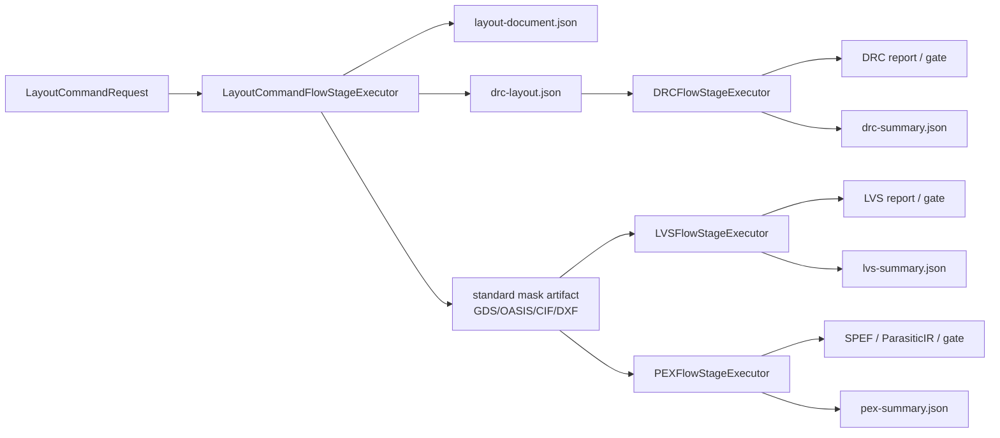
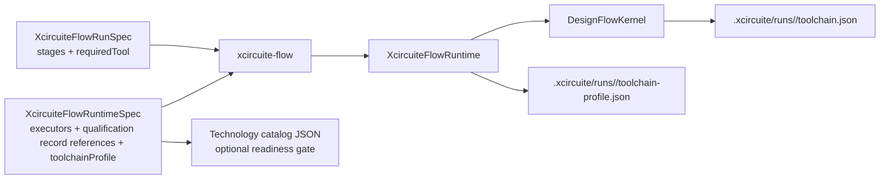

# Xcircuite

## Storage boundary

`XcircuiteWorkspaceStore` is the concrete filesystem boundary for the
project-local `.xcircuite` directory. Each actor instance is bound to exactly
one normalized project root; protocol calls carrying another root fail with a
typed error. Persisted `ArtifactReference` locations use project-relative
`.xcircuite/...` paths, while DesignFlowKernel remains unaware of the concrete
directory. The store rejects traversal, absolute artifact locations, workspace
symlinks and intermediate symlink escapes. Immutable artifacts and revisioned
run-ledger compare-and-swap updates are serialized by an atomic file lock.
Flow lifecycle and approval semantics remain in `DesignFlowKernel`.

Xcircuite is the headless core runtime of the LSI semiconductor design
platform. It provides the project-aware flow, CLI, artifact ledger integration,
tool qualification, and Agent-operable planning surface used by both
`circuit-studio` and non-UI callers.

`.xcircuite` project runtime is the composition boundary between
`DesignFlowKernel` and the engine packages. Stage executors invoke domain
protocols directly and project their typed results into flow records, gates,
and persisted artifacts. Domain verdict logic and parsers stay in the engine
packages; the explicit PDK external-inspection provider is the controlled
process boundary, using `SignoffToolSupport` and retaining raw process evidence
before `PDKKit` validates the typed result.

`XcircuiteEnginePackageDescriptor` expresses input and output roles with
CircuiteFoundation's open `ArtifactRole` token. Package discovery therefore
shares the same validated semantic role contract as every persisted
`ArtifactReference`; raw strings are not a parallel artifact schema.

## License

Xcircuite is source-available under the
[Xcircuite Commercial License 1.0](LICENSE). The public repository grants
Evaluation Use only. Production use, commercial product integration,
customer-facing deployment, redistribution, and sublicensing require a
separate written Commercial License Agreement with 1amageek.

See [the licensing model](docs/licensing.md) for the rights matrix and the
distinction between Xcircuite code and Third-Party Components.

## Umbrella architecture

[`Xcircuite`](https://github.com/1amageek/Xcircuite) is the umbrella runtime for
the local-first semiconductor design platform. The packages below remain
independently usable and own their domain contracts; Xcircuite composes them
through typed stage executors, artifact references, trust gates, and the
`.xcircuite` run ledger.

| Package | Responsibility | Repository |
|---|---|---|
| `CoreSpice` | In-process SPICE simulation and waveform analysis | [CoreSpice](https://github.com/1amageek/CoreSpice) |
| `semiconductor-layout` | Layout IR, editing, placement/routing, and native DRC preparation | [semiconductor-layout](https://github.com/1amageek/semiconductor-layout) |
| `swift-mask-data` | GDSII/OASIS/LEF/DEF/CIF/DXF mask-data I/O | [swift-mask-data](https://github.com/1amageek/swift-mask-data) |
| `DRCEngine` | Native and external DRC execution, diagnostics, and artifacts | [DRCEngine](https://github.com/1amageek/DRCEngine) |
| `LVSEngine` | Native and external LVS execution, matching, and assessment | [LVSEngine](https://github.com/1amageek/LVSEngine) |
| `PEXEngine` | Parasitic extraction, canonical `ParasiticIR`, and PEX artifacts | [PEXEngine](https://github.com/1amageek/PEXEngine) |
| `ToolQualification` | Tool capability, health, evidence, and trust gates | [ToolQualification](https://github.com/1amageek/ToolQualification) |
| `DesignFlowKernel` | Stage lifecycle, retries, approvals, and resume | [DesignFlowKernel](https://github.com/1amageek/DesignFlowKernel) |
| `SignoffToolSupport` | PDK discovery and safe external-process execution | [SignoffToolSupport](https://github.com/1amageek/SignoffToolSupport) |

## Development

Xcircuite is distributed as a Swift Package Manager library and exposes the
`Xcircuite` library together with the `xcircuite-flow` command-line tool. Use
the package manifest as the source of truth for dependency resolution, then
run `swift build` and `swift test` from the repository root. The package does
not require a UI session or a project-specific checkout layout. Xcircuite is
publicly available at <https://github.com/1amageek/Xcircuite>.

## Stage executors

| Type | Responsibility |
|---|---|
| `LogicElaborationFlowStageExecutor` / `PowerIntentFlowStageExecutor` / `LogicLoweringFlowStageExecutor` / `LogicSimulationFlowStageExecutor` | Execute the native logic pipeline from source and UPF/CPF through canonical snapshot and lowered execution design; direct input mode consumes the preceding stage's digest-bound artifact without generating mutable handoff requests |
| `PhysicalDesignFlowStageExecutor` | Executes a typed physical-design request for an explicitly allowed stage and retains the engine's immutable artifacts and diagnostics without promoting geometry-smoke execution to production P&R |
| `LayoutCommandFlowStageExecutor` | Applies replayable `LayoutCommands` requests through LayoutCommands' public `LayoutCommandRunning` protocol, verifies every runner-declared artifact against its bytes, digest, byte count, and evidence producer, safely normalizes locators to workspace-relative paths without dropping producer lineage, and can emit DRC-compatible JSON plus standard layout exports for downstream DRC/LVS/PEX stages |
| `DRCFlowStageExecutor` | Resolves and verifies exact DRC inputs, persists an immutable typed request and retry-replaceable producer-bound canonical execution result, indexes `drc-summary`, emits violation evaluation channels, and verifies manifest producer plus output integrity before stage success |
| `LVSFlowStageExecutor` | Resolves and verifies exact LVS inputs, persists an immutable typed request and retry-replaceable producer-bound canonical execution result, indexes `lvs-summary`, and verifies manifest producer plus output integrity before stage success |
| `PEXFlowStageExecutor` | Runs PEX through `PEXEngine`, exposes an explicit production factory for the real Magic backend, indexes extraction artifacts and `pex-summary` as `ArtifactReference`s, and blocks unavailable infrastructure without fabricating signoff output |
| `DFTFlowStageExecutor` / `DFTOracleCorrelationFlowStageExecutor` | Runs typed DFT requests and correlates retained oracle cases into raw, request-bound observations |
| `ProcessQualificationEvidenceBuilderFlowStageExecutor` | Builds ToolQualification-owned process evidence from independently retained artifact groups |
| `SimulationFlowStageExecutor` | Runs SPICE simulation through the canonical `CoreSpiceSimulationResult` contract, binds its provenance to the persisted netlist input, retains the exact producer on waveform/measurement/result artifacts, emits a run-level evaluation envelope, and gates on measurement expectations plus artifact integrity |
| `PostLayoutComparisonFlowStageExecutor` | Resolves exact pre/post waveform artifact references, retains them in comparison provenance, and persists the retry-safe canonical report with the comparison producer identity |
| `TimingSTAFlowStageExecutor` / `TimingSIFlowStageExecutor` | Invoke TimingEngine protocols directly and read every design, library, constraint, PDK, and parasitic input through `LocalArtifactVerifier` before analysis |
| `PDKDiscoveryFlowStageExecutor` / `PDKValidationFlowStageExecutor` | Discover and validate manifest-bound PDKs, then persist the typed result through the workspace transaction boundary with the domain execution producer retained in the artifact, ledger, and run manifest |
| `PDKCorpusValidationFlowStageExecutor` / `PDKOracleFlowStageExecutor` | Execute retained-corpus and oracle comparison contracts, preserve blocked/failed semantics, and retain result provenance as retry-safe run evidence |
| `PDKStandardViewInspectionFlowStageExecutor` / `PDKRuleDeckInspectionFlowStageExecutor` | Inspect manifest-bound standard views and rule decks locally or through the typed external process provider, persist retry-safe result evidence with its measured producer identity, and preserve blocked/failed contract diagnostics |
| Electrical corpus stage | Persists raw corpus and independent-oracle observations for ToolQualification without issuing trust |
| `PhysicalDesignReviewFlowStageExecutor` | Persists an immutable physical-design review packet, records the generic approval gate, and delegates reviewed-artifact integrity validation to `PhysicalDesignArtifactReviewValidator` |

PDK external inspection is selected by adding `externalProcess` to a tagged
`pdkStandardView` or `pdkRuleDeck` runtime executor. The configuration is
validated before runtime construction, expands only the documented request,
result, project, run and asset placeholders, executes the measured canonical
executable path, redacts configured sensitive argument positions from retained
records and provenance, and writes
`.xcircuite/runs/<run-id>/stages/<stage-id>/raw/external-pdk/` artifacts for the
request, result, stdout, stderr and execution record. The process result is
still subject to `PDKKit` schema, run, asset, format, source-reference and
digest-bound validation; process completion alone never promotes tool trust or
process qualification.

DFT execution and oracle correlation use distinct `dftExecution` and
`dftOracleCorrelation` runtime cases. The DFT stages produce raw results and
correlation observations. A separate `processQualificationEvidenceBuild` stage
uses ToolQualification to build process evidence; neither stage issues release
eligibility. `ReleaseEngine` consumes validated signoff evidence and
`DesignFlowKernel` owns approval, waiver, review, and resume.



`drc-layout.json` is produced only when the runtime spec includes
`LayoutCommandDRCExportSpec`. The adapter keeps this as a flow concern:
`LayoutCommands` mutates layout documents, while `DRCEngine` evaluates rules.
When `drcExport.viaDefinitions` is provided, layout-command vias are expanded
into DRC cut-layer rectangles with preserved net IDs.
Downstream DRC stages should consume this file through
`XcircuiteFlowInputReference.stageArtifact` with artifact ID `drc-layout`, so
runtime configs do not bake in a specific run ID and the recorded artifact digest
is verified before DRC runs.

Standard layout exports are produced when the runtime spec includes
`LayoutCommandStandardLayoutExportSpec`. The export uses `LayoutIO` and
`LayoutTechDatabase` to write GDSII/OASIS/CIF/DXF artifacts with stable artifact
IDs such as `layout-gds`, `layout-oasis`, `layout-cif`, or `layout-dxf`.
Downstream LVS stages consume GDSII/OASIS/CIF/DXF artifacts through
`XcircuiteFlowInputReference.stageArtifact`; PEX stages consume the currently
supported GDSII/OASIS handoff the same way. PEX source netlists and technology
JSON can also be provided through typed input references, which keeps run-scoped
artifact handoff separate from engine-specific extraction logic.

Native standard-layout LVS is profile-driven. Its process-owned extraction
profile, source deck, and process profile ID are explicit runtime inputs; the
profile schema, semantic coverage, identity, and deck digest are verified before
geometry extraction. They can be declared per stage or supplied together by the
run-level toolchain profile.

Runtime configs can also declare an `XcircuiteFlowToolchainProfile` at the top
level. The profile records PDK/catalog provenance, default DRC/LVS/PEX technology
inputs, and the native LVS extraction artifact set for signoff stages. Stage-local
fields override the profile, but stages that omit them can share the same run-level
profile instead of duplicating paths across every executor.

Every successful PEX stage writes `pex-summary.json` with stable artifact ID
`pex-summary`. The file is a `PEXRunSummaryReport` generated from the PEX manifest
and ParasiticIR artifacts, so Agent / CI / Human review can inspect per-corner
top parasitic nets from the `.xcircuite` run ledger without re-running PEX or
scraping logs.

`PEXFlowStageExecutor.production(...)` selects `DefaultPEXEngine.withDefaults()`
and the real backend named by `PEXBackendSelection`. Magic and OpenRCX retain
the measured executable version and SHA-256 identity in canonical provenance;
the stage rejects a producer that differs from its `pex-<backend>` tool ID or
from an explicitly configured expected producer. An unavailable executable,
PDK, or extraction deck is retained as typed `adapterUnavailable`
failure evidence and maps to a blocked flow stage; it does not produce a
`pex-summary` signoff artifact. Test-scoped extractors are injected directly
into `PEXFlowStageExecutor` from the test target and are not part of the public
runtime specification.

PEX stages also write a producer-bound `pex-summary` evidence envelope. The envelope expands
`PEXRunSummaryReport` into Agent-readable observation channels for artifact
completeness, failed corner count, total net/element count, total ground and
coupling capacitance, total resistance, per-corner ParasiticIR/SPEF presence,
and per-corner top-net parasitic values. Completeness gaps route to
`structureMapping`; dominant top-net signals stay at `localSurface` so an Agent
can decide whether the next step is extraction repair or post-layout metric
comparison.

Every DRC and LVS stage also writes a compact review artifact. `drc-summary.json`
uses stable artifact ID `drc-summary` and stores a `DRCRunSummaryReport`.
`lvs-summary.json` uses stable artifact ID `lvs-summary` and stores an
`LVSRunSummaryReport`. These summaries expose status, active/waived error counts,
waiver leftovers, and grouped violation/mismatch buckets while the full engine
report remains the detailed diagnostic source.

DRC stages also write `evidence/drc-summary-envelope.json`. The envelope expands
`DRCRunSummaryReport` into Agent-readable observation channels such as
`drc-active-violation-count`, `drc-violation-bucket-count`, per-rule
`drc-rule-<index>-<rule>-active-count`, related shape/net counts, and suggested
fix channels. Failed DRC buckets route feedback to `localSurface` with repair
planning actions, while missing tool evidence and unqualified calibration remain
explicit observation states instead of hidden log text.
Qualified calibration additionally requires a current retained process
qualification whose implementation identifier, tool version, and binary digest
exactly match the execution producer identifier, version, and measured build.

LVS stages similarly write `evidence/lvs-summary-envelope.json`. The envelope
expands `LVSRunSummaryReport` into `lvs-active-mismatch-count`,
`lvs-mismatch-bucket-count`, per-bucket
`lvs-mismatch-<index>-<rule>-active-count`, layout/schematic count, port, model,
parameter, device-policy, and suggested-fix channels. Feedback routes local
netlist/layout mismatches to `localSurface`, while policy/equivalence mismatches
route to `structureMapping` so Agent repair planning can choose the right edit
surface.

Before DRC/LVS/PEX stage results are persisted, Xcircuite verifies every indexed
stage output artifact with `LocalArtifactVerifier`. The stage result
contains an `artifact-integrity` gate for project containment, symlink
containment, SHA-256, and byte count. DRC and LVS stages also contain
`drc-artifacts` / `lvs-artifacts` gates that decode the engine artifact manifest
and prove every declared output is indexed in `FlowStageResult.artifacts`. PEX
keeps `pex-artifacts` for domain completeness and adds `pex-flow-artifacts` for
flow-ledger coverage of the persisted PEX manifest. A DRC/LVS/PEX engine result
can only make the stage succeed when its domain gate and artifact gates pass.
This keeps run-ledger artifacts, Human review bundles, and downstream
`stageArtifact` inputs on the same manifest and integrity contract.

## Flow runtime

`XcircuiteFlowRuntimeSpec` is the machine-readable runtime configuration used by
Agent / CLI / CI callers. It declares the stage executors that may be used for a
run, the in-process tool descriptors, health status, and trust evidence. The
runtime spec is consumed by `xcircuite-flow run` and `xcircuite-flow resume-run`;
it does not introduce an Agent wrapper.

The versioned JSON contract is documented in
[`docs/flow-runtime-schema.md`](docs/flow-runtime-schema.md).



| Type | Responsibility |
|---|---|
| `XcircuiteFlowRunSpec` | Run ID, intent, stage definitions, and `ToolTrustRequirement`s |
| `XcircuiteFlowRuntimeSpec` | Executor configuration, optional `ToolQualificationRecord` artifact references, and optional run-level signoff profile |
| `XcircuiteFlowToolchainProfile` | PDK/catalog provenance and default DRC/LVS/PEX technology inputs for shared signoff runs |
| `XcircuiteFlowTechnologyCatalog` | Catalog-backed readiness contract for matching profile PDK/catalog IDs and required local technology files |
| `XcircuiteFlowTechnologyCatalogInventory` | Agent-facing inventory report for PDK-root discovery, catalog entries, required-file resolution, and missing PDK/catalog assets |
| `XcircuiteFlowToolSpec` | Optional digest-bound `ArtifactReference` to a `ToolQualificationRecord` issued outside the Engine |
| `XcircuiteFlowRuntime` | Runs or resumes through `DesignFlowKernel` with the configured registry and executors |

`xcircuite-flow validate --project-root <path> --runtime-config <path>` gates
catalog-backed profile readiness before execution: profile IDs, PDK/catalog
matching, profile allow-lists, safe paths, and required file existence.
`xcircuite-flow inspect-toolchain-profile --runtime-config <path>
[--project-root <path>]` returns the same readiness state as JSON without
throwing on failed readiness, so Agent / CI callers can inspect missing
PDK/catalog files and decide the next action.
`xcircuite-flow inspect-technology-catalog --catalog-path <path>
[--project-root <path>]` lists catalog entries and required-file status directly.
It can also read `toolchainProfile.technologyCatalogPath` from
`--runtime-config`, and `--pdk-root <path>` performs bounded catalog discovery
under a local PDK root. Relative required files resolve from the catalog
directory first, then from declared PDK roots, so Agent callers can compare a
runtime profile against the broader local PDK inventory before selecting a
signoff profile.

The physical-design review boundary is intentionally narrower than signoff. It
proves immutable-manifest review, human approval binding, artifact re-hashing,
and same-run resume; it does not claim DRC, LVS, PEX, timing, foundry, or
process qualification. The retained Xcircuite regression covers this boundary
through `PhysicalDesignFlowStageExecutorTests/physicalReviewApprovalResumesFlow`.

The retained `EndToEndDesignFlowTests/retainedMultiEngineRunResumesAfterReview`
test additionally executes one run through SystemVerilog elaboration, lowering,
logic simulation, timing STA, physical floorplanning, layout materialization,
native DRC/LVS, a PEX stage, review-packet integrity, human approval and same-run
resume. Logic lowering consumes the elaboration artifact, logic simulation
consumes the lowered artifact, and DRC consumes the materialized layout artifact;
the test asserts the producer digests in downstream provenance/manifests. This is
integration evidence for the current handoff path; the test-scoped PEX
implementation proves the stage contract rather than physical signoff, and the
run does not promote local results to external-oracle or foundry/process
qualification.

Platform readiness covers LogicDesign, LogicEngine, RTL verification, DFT,
physical design, STA/SI, electrical signoff, release, and tapeout in addition to
the simulation/layout/DRC/LVS/PEX domains. Operation declarations alone never
pass a milestone: retained xcodebuild execution records, artifact integrity,
execution provenance, and stage gates are required. The
`production-qualified-release-flow` evidence remains mandatory and is not
provided by fixture or blocked-stage tests, so local smoke execution cannot be
reported as production-ready.

Engines emit raw `ObservationRecord` values. Domain-specific assessors derive
typed assessments from those observations. `ToolQualification` independently
verifies the retained observations and assessments before issuing a canonical
`ToolQualificationRecord`. Xcircuite receives only a digest-bound
`ArtifactReference` to that record. A run stage can require
the record's qualified evidence through
`ToolTrustRequirement.requiredQualifiedEvidenceKinds`. During runtime
construction, `ToolQualification` re-hashes the record and its retained evidence,
then verifies tool identity, issuer, timestamp, scope, and issuance decisions.
Missing, stale, non-canonical, or mismatched records block at the `tool-trust`
gate and are persisted in `toolchain.json`.
Runtime configs are validated before runtime construction and evidence
attachment: the executor list must be non-empty, executor `stageID`s must be valid
Xcircuite identifiers, duplicate executor stage IDs are rejected, and present
toolchain profiles must pass readiness validation for stable profile / PDK /
catalog identifiers plus safe technology references. Use
`inspect-toolchain-profile` when a structured readiness report is needed without
turning failed readiness into a CLI failure.
Run specs are validated before request construction: intent and stages must be
non-empty, `runID` and stage IDs must be valid Xcircuite identifiers, stage
display names must be non-empty, and duplicate run stage IDs are rejected. When
`xcircuite-flow validate` receives both a run spec and runtime config, it also
checks that every run stage has a runtime executor.

Run specs also carry `FlowStageRetryPolicy` per stage. `DesignFlowKernel`
executes the bounded retry loop, while Xcircuite keeps engine diagnostics stable
enough for policy matching. Transient DRC, LVS, PEX, and simulation backend
failures are normalized to `DRC_EXECUTION_ERROR`, `LVS_EXECUTION_ERROR`,
`PEX_EXECUTION_ERROR`, and `SIMULATION_EXECUTION_ERROR`, can be retried by
policy, and produce `stages/<stage-id>/attempts.json` plus a `stage-attempts`
review-bundle artifact.
`XcircuiteFlowRuntimeTests/runtimeRetriesTransientDRCExecutorFailureAndPersistsAttempts`,
`SignoffFlowStageExecutorTests/lvsExecutorRetriesTransientFailureAndPersistsAttempts`,
`PEXFlowStageExecutorTests/pexExecutorRetriesTransientFailureAndPersistsAttempts`,
and `SimulationFlowStageExecutorTests/simulationExecutorRetriesTransientFailureAndPersistsAttempts`
prove these paths through the runtime and engine-backed stage boundaries.

## CLI

```bash
xcircuite-flow run \
  --project-root <project-root> \
  --run-spec <run.json> \
  --runtime-config <runtime.json>

xcircuite-flow resume-run \
  --project-root <project-root> \
  --run-id <run-id> \
  --runtime-config <runtime.json>

xcircuite-flow attach-qualification-record \
  --project-root <project-root> \
  --runtime-config <runtime.json> \
  --stage-id <stage-id> \
  --record-reference <qualification-record-reference.json> \
  --out <runtime-with-record.json>

xcircuite-flow validate \
  --run-spec <run.json> \
  --runtime-config <runtime.json>

xcircuite-flow inspect-platform-capabilities \
  --run-id <run-id> \
  --generated-at <timestamp> \
  --test-evidence <readiness-or-test-evidence.json>
```

Planning commands operate directly on `.xcircuite/runs/<run-id>/planning/`
artifacts. They provide the Agent-facing repair/improvement surface without
introducing an Agent wrapper.

| Command | Writes |
|---|---|
| `inspect-platform-capabilities` | JSON readiness report for platform milestones: standalone local signoff, Agent-operable design loop, human review/audit, standard-format grounding, and post-layout improvement planning; each milestone lists required domains, operations, artifacts, verification gates, regression test evidence, missing items, planned/partial operations, and next actions. Test evidence without `executionStatus: "passed"` keeps readiness partial; `--test-evidence` accepts either a test evidence array or a previous readiness report. |
| `generate-planning-problem` | `planning/problem.json` from DRC/LVS/PEX summary inputs with generated assumptions, risk classifications, objectives, constraints, candidate actions, verification gates, and resume contract |
| `audit-problem-translation` | `planning/problem-translation-audit.json` with source-to-objective/action/constraint/goal/gate coverage, uncovered source refs, orphan problem elements, blocking diagnostics, and next actions before planner execution |
| `validate-planning-problem` | `planning/problem-validation.json` with schema/reference, assumption/risk, objective/action-domain, verification-gate, and freshly refreshed translation-audit diagnostics before planner execution |
| `generate-candidate-plan` | Immutable, content-addressed `planning/generated-candidate-plans/<sha256>.json` and `planning/generated-symbolic-planner-traces/<sha256>.json` artifacts from typed planning problems with selected-step assumptions and risk classifications for review; blocks when the freshly refreshed translation audit is blocking |
| `symbolic-planner-feature-matrix` | symbolic planner coverage matrix with required corpus validation tags, implemented/planned coverage tags, evidence refs, and remaining work; corpus assessment validates suite and case coverage tags against implemented matrix entries |
| `export-symbolic-planner-problem` | `planning/symbolic-planner/domain.pddl`, `planning/symbolic-planner/problem.pddl`, and `planning/symbolic-planner/pddl-export.json` for external symbolic planners; blocks when the freshly refreshed translation audit is blocking |
| `run-symbolic-planner-solver` | `planning/symbolic-planner/solver-run.json`, `solver-stdout.txt`, `solver-stderr.txt`, `solver-plan.txt`, and imported `planning/candidate-plan.json` from a timeout-bounded external PDDL solver process |
| `validate-symbolic-planner-solver` | `planning/symbolic-planner/solver-validation.json` containing domain validation from expected action, goal coverage, certificate, proof, and optimality checks; it does not issue tool trust or qualification |
| `assess-symbolic-planner-solver-corpus` | `.xcircuite/assessments/symbolic-planner/<suite-id>/solver-corpus-assessment-suite.json` plus `solver-corpus-assessment.json` with reproducible suite input, required coverage tags, multi-case pass rate, and per-case validation refs; ToolQualification remains the sole issuer and validator of qualification records |
| `import-symbolic-planner-plan` | `planning/symbolic-planner/solver-plan.txt` and risk-projected `planning/candidate-plan.json` from a PDDL-compatible external solver plan |
| `generate-parameter-candidates` | `planning/parameter-candidates.jsonl` and `planning/parameter-candidate-search-trace.json` from bounded `parameterBounds` hints, including `adaptive-bounded-refinement` and `feedback-aware-bounded-refinement` ordering |
| `synthesize-parameter-candidate-plan` | risk-projected `planning/candidate-plan.json` from a selected bounded parameter candidate, skipping rejected candidates from `planning/rejected-plans.jsonl` unless explicitly included and returning a `costModel`-weighted feedback selection trace |
| `approve-candidate-plan-risk` | `.xcircuite/runs/<run-id>/approvals/<approval-id>.json` using the shared `FlowApprovalRecord` schema |
| `execute-candidate-plan` | Immutable `planning/plan-execution/<sha256>.json`, produced layout/netlist artifacts, `design-diffs/<sha256>.json`, and `actions.jsonl`; approval-required risk blocks before design mutation unless the required approval record is approved |
| `verify-candidate-plan` | Immutable `planning/plan-verification/<sha256>.json` with symbolic state, gate results, `riskReviews`, approval review state, `planning/rejected-plans.jsonl` for rejected/blocked plans, plus post-execution DRC/LVS/PEX/simulation metric artifacts when inputs exist |
| `run-numeric-repair-loop` | `planning/numeric-repair-loop.json` plus per-iteration snapshots under `planning/numeric-repair-loop/iterations/` while generating candidates, synthesizing edits, executing, verifying, and feeding rejected candidates into the next iteration |
| `assess-verified-improvement-corpus` | `.xcircuite/assessments/verified-improvement/<suite-id>/corpus-suite.json` and `corpus-report.json` with typed DRC/LVS/PEX/numeric-loop outcome assessment; it does not issue tool qualification |
| `run-selected-suggested-action` | loads the latest ready `review.selectSuggestedAction` record, validates its run binding, then projects the typed semantic operation into this project's `xcircuite-flow --project-root` invocation and dispatches through the typed CLI handler |

`execute-candidate-plan` and `verify-candidate-plan` use the sole retained
generated candidate when selection is unambiguous, then fall back to the
canonical `planning/candidate-plan.json`. If multiple immutable generated
candidates exist, callers must select one with `--candidate-plan-artifact-id`
or `--candidate-plan-path`; no implicit latest-candidate fallback is applied.

Default platform-readiness test evidence uses exact Xcode test identifiers,
including the `()` suffix for Swift Testing methods. Every evidence command is
wrapped by a 120-second alarm and runs through `xcodebuild test`. DRCEngine CLI
evidence selects the `DRCCLICoreTests` test target.

The key artifacts for trust review are:

```text
<project-root>/.xcircuite/runs/<run-id>/toolchain.json
<project-root>/.xcircuite/runs/<run-id>/toolchain-profile.json
```

Inspect them to confirm selected/rejected tools, health status, evidence,
qualified corpus/oracle summaries, and the PDK/catalog technology profile used by
DRC/LVS/PEX.

## Contract fixtures

Committed runtime/run spec fixtures live under
`Tests/XcircuiteTests/Fixtures/FlowRuntime/`.

| Fixture | Purpose |
|---|---|
| `qualified-evidence-run.json` | Run spec whose DRC stage requires `requiredQualifiedEvidenceKinds: ["corpus"]` plus `maximumEvidenceAgeSeconds` |
| `qualified-signoff-run.json` | Run spec whose DRC/LVS/PEX stages require qualified corpus evidence |

Regression:

```bash
xcodebuild -scheme Xcircuite-Package -destination 'platform=macOS' \
  -only-testing:XcircuiteTests/XcircuiteQualificationRecordIntegrationTests \
  -test-timeouts-enabled YES -maximum-test-execution-time-allowance 60 test
```

## Engine seams

| Protocol | Implementation |
|---|---|
| `DRCExecuting` / `LVSExecuting` / `PEXExecuting` | Domain engine implementation injected directly into the stage executor |
| `SimulationExecuting` | `CoreSpiceSimulationEngine` — runs CoreSpice in-process, executes the netlist's own `.op` / `.dc` / `.ac` / `.tran` / `.noise` / `.tf` / `.sens` / `.pz` / `.four` / `.mc`, evaluates `.measure` results, and persists real, complex, or Monte Carlo statistics CSV artifacts without silently substituting a different analysis |

The simulation gate compares declared `SimulationMeasurementExpectation`s
(name / target / tolerance) against the netlist's `.measure` results; a missing
expected measurement is a failure (`SIMULATION_MEASUREMENT_MISSING`), not a pass.
Golden waveform regression checks are available through
`SimulationGoldenComparisonService` and
`xcircuite-flow compare-simulation-golden`, producing a JSON report with
required-variable coverage, variable-level deltas, worst points, interpolation
policy, and gate violations.
Checked-in simulation corpus assessment is available through
`SimulationGoldenCorpusRunner` and
`xcircuite-flow assess-simulation-golden-corpus`, which run SPICE netlists,
compare produced waveforms against golden CSV baselines, and retain per-case
candidate waveform / comparison artifacts as canonical `ArtifactReference`
values with coverage tags. The corpus report does not define its own artifact
reference shape. The default artifacts are stored under
`.xcircuite/assessments/simulation-golden/<suite-id>/`. This canonical
representation is simulation golden corpus report schema version 2.

## Support types

| Type | Responsibility |
|---|---|
| `SignoffToolDescriptors` | Tool descriptors for layout commands, Native DRC/LVS backends, CoreSpice simulation, and PEX backends |
| `StageArtifactReferenceBuilder` | Builds `ArtifactReference`s for stage outputs (artifact ID, path, kind, format, digest) |
| `XcircuiteRuntimeError` | Typed runtime failures |

## Build & test

```bash
swift build
perl -e 'alarm 420; exec @ARGV' swift test --parallel --num-workers 4
```

The latest bounded full regression passed 557 test cases in 59 suites using a
serial SwiftPM runner. This is package-integration evidence, not foundry or
process qualification.
