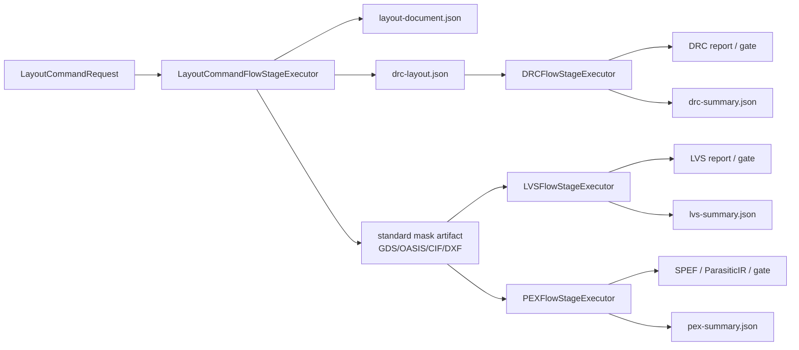
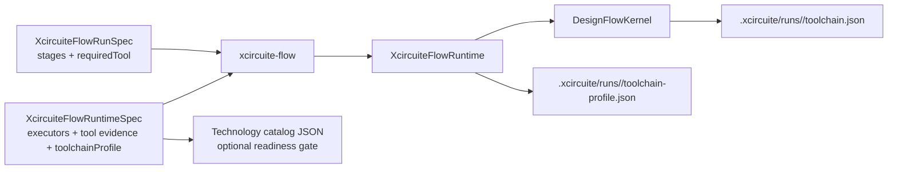

# Xcircuite

Xcircuite is the headless core runtime of the LSI semiconductor design
platform. It provides the project-aware flow, CLI, artifact ledger integration,
tool qualification, and Agent-operable planning surface used by both
`circuit-studio` and non-UI callers.

`.xcircuite` project runtime: the adapter layer between `DesignFlowKernel` and the
engine packages. It turns engine results into `FlowStageResult`s, gates, and
artifact references — and implements **no** verdict logic, parsers, or external
tool invocation itself (those stay in `CoreSpice` / `DRCEngine` / `LVSEngine` /
`PEXEngine`).

## License

Xcircuite is source-available under the
[Xcircuite Commercial License 1.0](LICENSE). The public repository grants
Evaluation Use only. Production use, commercial product integration,
customer-facing deployment, redistribution, and sublicensing require a
separate written Commercial License Agreement with 1amageek.

See [the licensing model](docs/licensing.md) for the rights matrix and the
distinction between Xcircuite code and Third-Party Components.

## Development checkout

The package manifest currently resolves the LSI engine packages through sibling
path dependencies (`../CoreSpice`, `../DRCEngine`, `../LVSEngine`, and related
packages). Build and test the package from the LSI workspace until those
dependencies have public versioned SwiftPM repositories. Xcircuite itself is
publicly available at <https://github.com/1amageek/Xcircuite>.

## Stage executors

| Type | Responsibility |
|---|---|
| `LayoutCommandFlowStageExecutor` | Applies replayable `LayoutCommands` requests, writes flow-managed layout/result/manifest artifacts, and can emit DRC-compatible JSON plus standard layout exports for downstream DRC/LVS/PEX stages |
| `DRCFlowStageExecutor` | Runs DRC through `DRCEngine`, converts the result to stage result / gates / artifacts, indexes `drc-summary`, emits DRC-specific evaluation channels for violation buckets, and verifies output artifact references before stage success |
| `LVSFlowStageExecutor` | Runs LVS through `LVSEngine`, converts the result to stage result / gates / artifacts, indexes `lvs-summary`, and verifies output artifact references before stage success |
| `PEXFlowStageExecutor` | Runs PEX through `PEXEngine`, exposes an explicit production factory for the real Magic backend, indexes extraction artifacts and `pex-summary` as `XcircuiteFileReference`s, and blocks unavailable infrastructure without fabricating signoff output |
| `SimulationFlowStageExecutor` | Runs SPICE simulation, persists netlist/waveform/measurement/`simulation-summary` artifacts, emits a run-level evaluation envelope with measurement residual/tolerance and waveform-variable channels, and gates on measurement expectations plus artifact integrity |
| `PhysicalDesignReviewFlowStageExecutor` | Persists an immutable physical-design review packet, records the generic approval gate, re-hashes reviewed artifacts on resume, and delegates approval validation to `PhysicalDesignReviewGate` |



`drc-layout.json` is produced only when the runtime spec includes
`LayoutCommandDRCExportSpec`. The adapter keeps this as a flow concern:
`LayoutCommands` mutates layout documents, while `DRCEngine` evaluates rules.
When `drcExport.viaDefinitions` is provided, layout-command vias are expanded
into DRC cut-layer rectangles with preserved net IDs.
Downstream DRC stages should consume this file through
`XcircuiteFlowInputReference.stageArtifact` with artifact ID `drc-layout`, so
runtime configs do not bake in a specific run ID and the recorded artifact digest
is verified before DRC runs.

Standard layout exports are produced when the runtime spec includes
`LayoutCommandStandardLayoutExportSpec`. The export uses `LayoutIO` and
`LayoutTechDatabase` to write GDSII/OASIS/CIF/DXF artifacts with stable artifact
IDs such as `layout-gds`, `layout-oasis`, `layout-cif`, or `layout-dxf`.
Downstream LVS stages consume GDSII/OASIS/CIF/DXF artifacts through
`XcircuiteFlowInputReference.stageArtifact`; PEX stages consume the currently
supported GDSII/OASIS handoff the same way. PEX source netlists and technology
JSON can also be provided through typed input references, which keeps run-scoped
artifact handoff separate from engine-specific extraction logic.

Runtime configs can also declare an `XcircuiteFlowToolchainProfile` at the top
level. The profile records PDK/catalog provenance and default DRC, LVS, and PEX
technology inputs for signoff stages. Stage-local technology fields override the
profile, but stages that omit them can share the same run-level profile instead
of duplicating paths across every executor.

Every successful PEX stage writes `pex-summary.json` with stable artifact ID
`pex-summary`. The file is a `PEXRunSummaryReport` generated from the PEX manifest
and ParasiticIR artifacts, so Agent / CI / Human review can inspect per-corner
top parasitic nets from the `.xcircuite` run ledger without re-running PEX or
scraping logs.

`PEXFlowStageExecutor.production(...)` selects `DefaultPEXEngine.withDefaults()`
and the real backend named by `PEXBackendSelection`. An unavailable Magic
executable, PDK, or extraction deck is retained as typed `adapterUnavailable`
failure evidence and maps to a blocked flow stage; it does not produce a
`pex-summary` signoff artifact. `PEXFlowStageExecutor.mock(...)` remains an
explicit contract-test lane and is never accepted by the production runtime
spec.

PEX stages also write `evidence/pex-summary-envelope.json`. The envelope expands
`PEXRunSummaryReport` into Agent-readable observation channels for artifact
completeness, failed corner count, total net/element count, total ground and
coupling capacitance, total resistance, per-corner ParasiticIR/SPEF presence,
and per-corner top-net parasitic values. Completeness gaps route to
`structureMapping`; dominant top-net signals stay at `localSurface` so an Agent
can decide whether the next step is extraction repair or post-layout metric
comparison.

Every DRC and LVS stage also writes a compact review artifact. `drc-summary.json`
uses stable artifact ID `drc-summary` and stores a `DRCRunSummaryReport`.
`lvs-summary.json` uses stable artifact ID `lvs-summary` and stores an
`LVSRunSummaryReport`. These summaries expose status, active/waived error counts,
waiver leftovers, and grouped violation/mismatch buckets while the full engine
report remains the detailed diagnostic source.

DRC stages also write `evidence/drc-summary-envelope.json`. The envelope expands
`DRCRunSummaryReport` into Agent-readable observation channels such as
`drc-active-violation-count`, `drc-violation-bucket-count`, per-rule
`drc-rule-<index>-<rule>-active-count`, related shape/net counts, and suggested
fix channels. Failed DRC buckets route feedback to `localSurface` with repair
planning actions, while missing tool evidence and unqualified calibration remain
explicit observation states instead of hidden log text.

LVS stages similarly write `evidence/lvs-summary-envelope.json`. The envelope
expands `LVSRunSummaryReport` into `lvs-active-mismatch-count`,
`lvs-mismatch-bucket-count`, per-bucket
`lvs-mismatch-<index>-<rule>-active-count`, layout/schematic count, port, model,
parameter, device-policy, and suggested-fix channels. Feedback routes local
netlist/layout mismatches to `localSurface`, while policy/equivalence mismatches
route to `structureMapping` so Agent repair planning can choose the right edit
surface.

Before DRC/LVS/PEX stage results are persisted, Xcircuite verifies every indexed
stage output artifact with `XcircuiteFileReferenceVerifier`. The stage result
contains an `artifact-integrity` gate for project containment, symlink
containment, SHA-256, and byte count. DRC and LVS stages also contain
`drc-artifacts` / `lvs-artifacts` gates that decode the engine artifact manifest
and prove every declared output is indexed in `FlowStageResult.artifacts`. PEX
keeps `pex-artifacts` for domain completeness and adds `pex-flow-artifacts` for
flow-ledger coverage of the persisted PEX manifest. A DRC/LVS/PEX engine result
can only make the stage succeed when its domain gate and artifact gates pass.
This keeps run-ledger artifacts, Human review bundles, and downstream
`stageArtifact` inputs on the same manifest and integrity contract.

## Flow runtime

`XcircuiteFlowRuntimeSpec` is the machine-readable runtime configuration used by
Agent / CLI / CI callers. It declares the stage executors that may be used for a
run, the in-process tool descriptors, health status, and trust evidence. The
runtime spec is consumed by `xcircuite-flow run` and `xcircuite-flow resume-run`;
it does not introduce an Agent wrapper.

The versioned JSON contract is documented in
[`docs/flow-runtime-schema.md`](docs/flow-runtime-schema.md).



| Type | Responsibility |
|---|---|
| `XcircuiteFlowRunSpec` | Run ID, intent, stage definitions, and `ToolTrustRequirement`s |
| `XcircuiteFlowRuntimeSpec` | Executor configuration, tool qualification level, health status, evidence, and optional run-level signoff profile |
| `XcircuiteFlowToolchainProfile` | PDK/catalog provenance and default DRC/LVS/PEX technology inputs for shared signoff runs |
| `XcircuiteFlowTechnologyCatalog` | Catalog-backed readiness contract for matching profile PDK/catalog IDs and required local technology files |
| `XcircuiteFlowTechnologyCatalogInventory` | Agent-facing inventory report for PDK-root discovery, catalog entries, required-file resolution, and missing PDK/catalog assets |
| `XcircuiteFlowToolSpec` | Per-tool trust inputs: qualification level, health status, `ToolEvidence` |
| `XcircuiteFlowRuntime` | Runs or resumes through `DesignFlowKernel` with the configured registry and executors |

`xcircuite-flow validate --project-root <path> --runtime-config <path>` gates
catalog-backed profile readiness before execution: profile IDs, PDK/catalog
matching, profile allow-lists, safe paths, and required file existence.
`xcircuite-flow inspect-toolchain-profile --runtime-config <path>
[--project-root <path>]` returns the same readiness state as JSON without
throwing on failed readiness, so Agent / CI callers can inspect missing
PDK/catalog files and decide the next action.
`xcircuite-flow inspect-technology-catalog --catalog-path <path>
[--project-root <path>]` lists catalog entries and required-file status directly.
It can also read `toolchainProfile.technologyCatalogPath` from
`--runtime-config`, and `--pdk-root <path>` performs bounded catalog discovery
under a local PDK root. Relative required files resolve from the catalog
directory first, then from declared PDK roots, so Agent callers can compare a
runtime profile against the broader local PDK inventory before selecting a
signoff profile.

The physical-design review boundary is intentionally narrower than signoff. It
proves immutable-manifest review, human approval binding, artifact re-hashing,
and same-run resume; it does not claim DRC, LVS, PEX, timing, foundry, or
process qualification. The retained Xcircuite regression covers this boundary
through `PhysicalDesignFlowStageExecutorTests/physicalReviewApprovalResumesFlow`.

The retained `EndToEndDesignFlowTests/retainedMultiEngineRunResumesAfterReview`
test additionally executes one run through LogicDesign lowering, logic
simulation, timing STA, physical floorplanning, native DRC/LVS, deterministic
mock PEX, review-packet integrity, human approval and same-run resume. This is
integration evidence for the current handoff path; mock PEX is contract
evidence rather than physical signoff and the run does not promote local
results to external-oracle or foundry/process qualification.

Qualified evidence is passed as `ToolEvidence.qualification`. A run stage can
require it through `ToolTrustRequirement.requiredQualifiedEvidenceKinds`. When the
evidence is missing or failed, `DesignFlowKernel` blocks at the `tool-trust` gate
and persists the rejected decision in `toolchain.json`. When the evidence is
qualified, the same manifest records the selected tool and the evidence summary.
Runtime configs are validated before runtime construction and evidence
attachment: the executor list must be non-empty, executor `stageID`s must be valid
Xcircuite identifiers, duplicate executor stage IDs are rejected, and present
toolchain profiles must pass readiness validation for stable profile / PDK /
catalog identifiers plus safe technology references. Use
`inspect-toolchain-profile` when a structured readiness report is needed without
turning failed readiness into a CLI failure.
Run specs are validated before request construction: intent and stages must be
non-empty, `runID` and stage IDs must be valid Xcircuite identifiers, stage
display names must be non-empty, and duplicate run stage IDs are rejected. When
`xcircuite-flow validate` receives both a run spec and runtime config, it also
checks that every run stage has a runtime executor.

Run specs also carry `FlowStageRetryPolicy` per stage. `DesignFlowKernel`
executes the bounded retry loop, while Xcircuite keeps engine diagnostics stable
enough for policy matching. Transient DRC, LVS, PEX, and simulation backend
failures are normalized to `DRC_EXECUTION_ERROR`, `LVS_EXECUTION_ERROR`,
`PEX_EXECUTION_ERROR`, and `SIMULATION_EXECUTION_ERROR`, can be retried by
policy, and produce `stages/<stage-id>/attempts.json` plus a `stage-attempts`
review-bundle artifact.
`XcircuiteFlowRuntimeTests/runtimeRetriesTransientDRCExecutorFailureAndPersistsAttempts`,
`SignoffFlowStageExecutorTests/lvsExecutorRetriesTransientFailureAndPersistsAttempts`,
`PEXFlowStageExecutorTests/pexExecutorRetriesTransientFailureAndPersistsAttempts`,
and `SimulationFlowStageExecutorTests/simulationExecutorRetriesTransientFailureAndPersistsAttempts`
prove these paths through the runtime and engine-backed stage boundaries.

## CLI

```bash
xcircuite-flow run \
  --project-root <project-root> \
  --run-spec <run.json> \
  --runtime-config <runtime.json>

xcircuite-flow resume-run \
  --project-root <project-root> \
  --run-id <run-id> \
  --runtime-config <runtime.json>

xcircuite-flow attach-evidence \
  --runtime-config <runtime.json> \
  --stage-id <stage-id> \
  --evidence <tool-evidence-export.json> \
  --out <runtime-with-evidence.json>

xcircuite-flow validate \
  --run-spec <run.json> \
  --runtime-config <runtime.json>

xcircuite-flow inspect-platform-capabilities \
  --run-id <run-id> \
  --generated-at <timestamp> \
  --test-evidence <readiness-or-test-evidence.json>
```

Planning commands operate directly on `.xcircuite/runs/<run-id>/planning/`
artifacts. They provide the Agent-facing repair/improvement surface without
introducing an Agent wrapper.

| Command | Writes |
|---|---|
| `inspect-platform-capabilities` | JSON readiness report for platform milestones: standalone local signoff, Agent-operable design loop, human review/audit, standard-format grounding, and post-layout improvement planning; each milestone lists required domains, operations, artifacts, verification gates, regression test evidence, missing items, planned/partial operations, and next actions. Test evidence without `executionStatus: "passed"` keeps readiness partial; `--test-evidence` accepts either a test evidence array or a previous readiness report. |
| `generate-planning-problem` | `planning/problem.json` from DRC/LVS/PEX summary inputs with generated assumptions, risk classifications, objectives, constraints, candidate actions, verification gates, and resume contract |
| `audit-problem-translation` | `planning/problem-translation-audit.json` with source-to-objective/action/constraint/goal/gate coverage, uncovered source refs, orphan problem elements, blocking diagnostics, and next actions before planner execution |
| `validate-planning-problem` | `planning/problem-validation.json` with schema/reference, assumption/risk, objective/action-domain, verification-gate, and freshly refreshed translation-audit diagnostics before planner execution |
| `generate-candidate-plan` | `planning/candidate-plan.json` from typed planning problems with selected-step assumptions and risk classifications for review; blocks when the freshly refreshed translation audit is blocking |
| `symbolic-planner-feature-matrix` | symbolic planner coverage matrix with required corpus trust tags, implemented/planned coverage tags, evidence refs, and remaining work; corpus qualification validates suite and case coverage tags against implemented matrix entries |
| `export-symbolic-planner-problem` | `planning/symbolic-planner/domain.pddl`, `planning/symbolic-planner/problem.pddl`, and `planning/symbolic-planner/pddl-export.json` for external symbolic planners; blocks when the freshly refreshed translation audit is blocking |
| `run-symbolic-planner-solver` | `planning/symbolic-planner/solver-run.json`, `solver-stdout.txt`, `solver-stderr.txt`, `solver-plan.txt`, and imported `planning/candidate-plan.json` from a timeout-bounded external PDDL solver process |
| `qualify-symbolic-planner-solver` | `planning/symbolic-planner/solver-qualification.json` and ToolHealthCheckResult-compatible evidence from expected action and goal coverage checks |
| `qualify-symbolic-planner-solver-corpus` | `.xcircuite/qualification/symbolic-planner/<suite-id>/solver-qualification-corpus-suite.json` plus `solver-qualification-corpus.json` with reproducible suite input, required coverage tags, multi-case pass rate, per-case qualification refs, and aggregate ToolHealthCheckResult-compatible evidence |
| `import-symbolic-planner-plan` | `planning/symbolic-planner/solver-plan.txt` and risk-projected `planning/candidate-plan.json` from a PDDL-compatible external solver plan |
| `generate-parameter-candidates` | `planning/parameter-candidates.jsonl` and `planning/parameter-candidate-search-trace.json` from bounded `parameterBounds` hints, including `adaptive-bounded-refinement` and `feedback-aware-bounded-refinement` ordering |
| `synthesize-parameter-candidate-plan` | risk-projected `planning/candidate-plan.json` from a selected bounded parameter candidate, skipping rejected candidates from `planning/rejected-plans.jsonl` unless explicitly included and returning a `costModel`-weighted feedback selection trace |
| `approve-candidate-plan-risk` | `.xcircuite/runs/<run-id>/approvals/<approval-id>.json` using the shared `XcircuiteApprovalRecord` schema |
| `execute-candidate-plan` | `planning/plan-execution.json`, produced layout/netlist artifacts, `design-diff.json`, and `actions.jsonl`; approval-required risk blocks before design mutation unless the required approval record is approved |
| `verify-candidate-plan` | `planning/plan-verification.json` with symbolic state, gate results, `riskReviews`, approval review state, `planning/rejected-plans.jsonl` for rejected/blocked plans, plus post-execution DRC/LVS/PEX/simulation metric artifacts when inputs exist |
| `run-numeric-repair-loop` | `planning/numeric-repair-loop.json` plus per-iteration snapshots under `planning/numeric-repair-loop/iterations/` while generating candidates, synthesizing edits, executing, verifying, and feeding rejected candidates into the next iteration |
| `run-selected-suggested-command` | loads the latest ready `review.selectSuggestedCommand` action, validates the same project/run, `xcircuite-flow` executable, readiness, and command allowlist, then dispatches through the typed CLI handler without arbitrary shell execution |

The key artifacts for trust review are:

```text
<project-root>/.xcircuite/runs/<run-id>/toolchain.json
<project-root>/.xcircuite/runs/<run-id>/toolchain-profile.json
```

Inspect them to confirm selected/rejected tools, health status, evidence,
qualified corpus/oracle summaries, and the PDK/catalog technology profile used by
DRC/LVS/PEX.

## Contract fixtures

Committed runtime/run spec fixtures live under
`Tests/XcircuiteTests/Fixtures/FlowRuntime/`.

| Fixture | Purpose |
|---|---|
| `qualified-evidence-runtime.json` | Runtime config with timestamped `ToolEvidence.qualification` for a DRC corpus gate |
| `qualified-evidence-run.json` | Run spec whose DRC stage requires `requiredQualifiedEvidenceKinds: ["corpus"]` plus `maximumEvidenceAgeSeconds` |
| `qualified-signoff-runtime.json` | Runtime config for DRC/LVS/PEX signoff stages before evidence attachment |
| `qualified-signoff-run.json` | Run spec whose DRC/LVS/PEX stages require qualified corpus evidence |
| `drc-tool-evidence-export.json` | DRC corpus evidence export consumed by `xcircuite-flow attach-evidence` |
| `lvs-tool-evidence-export.json` | LVS corpus evidence export consumed by `xcircuite-flow attach-evidence` |
| `pex-tool-evidence-export.json` | PEX SPEF corpus evidence export consumed by `xcircuite-flow attach-evidence` |

Regression:

```bash
perl -e 'alarm shift; exec @ARGV' 240 swift test --filter XcircuiteFlowRuntimeTests/runCLIAcceptsQualifiedEvidenceFixtureContracts
perl -e 'alarm shift; exec @ARGV' 240 swift test --filter XcircuiteFlowRuntimeTests/runCLIAcceptsQualifiedSignoffFixtureContracts
perl -e 'alarm shift; exec @ARGV' 240 swift test --filter XcircuiteFlowRuntimeTests/attachEvidenceCLIProducesRunnableQualifiedRuntimeConfig
perl -e 'alarm shift; exec @ARGV' 240 swift test --filter XcircuiteFlowRuntimeTests/validateCLIReportsRunRuntimeAndCoverage
perl -e 'alarm shift; exec @ARGV' 300 swift test --filter XcircuiteFlowRuntimeTests/runtimeRetriesTransientDRCExecutorFailureAndPersistsAttempts
perl -e 'alarm shift; exec @ARGV' 240 swift test --filter XcircuiteFlowRuntimeTests/runtimeSpecBuildsRuntimeForLayoutCommandExecutor
perl -e 'alarm shift; exec @ARGV' 300 swift test --filter XcircuiteFlowRuntimeTests/runtimeFeedsLayoutCommandDRCExportIntoDRCStage
perl -e 'alarm shift; exec @ARGV' 300 swift test --filter XcircuiteFlowRuntimeTests/runtimeSpecRoundTripsStageArtifactInputReference
perl -e 'alarm shift; exec @ARGV' 300 swift test --filter XcircuiteFlowRuntimeTests/stageArtifactInputReferenceRejectsDigestMismatch
perl -e 'alarm shift; exec @ARGV' 300 swift test --filter XcircuiteFlowRuntimeTests/runtimeSpecValidationRejectsDRCWithoutLayoutInput
```

## Engine seams

| Protocol | Implementation |
|---|---|
| `DRCExecuting` / `LVSExecuting` / `PEXExecuting` | Engine swapped in from the adapter side |
| `SimulationExecuting` | `CoreSpiceSimulationEngine` — runs CoreSpice in-process, executes the netlist's own `.op` / `.dc` / `.ac` / `.tran` / `.noise` / `.tf` / `.sens` / `.pz` / `.four` / `.mc`, evaluates `.measure` results, and persists real, complex, or Monte Carlo statistics CSV artifacts without silently substituting a different analysis |

The simulation gate compares declared `SimulationMeasurementExpectation`s
(name / target / tolerance) against the netlist's `.measure` results; a missing
expected measurement is a failure (`SIMULATION_MEASUREMENT_MISSING`), not a pass.
Golden waveform regression checks are available through
`SimulationGoldenComparisonService` and
`xcircuite-flow compare-simulation-golden`, producing a JSON report with
required-variable coverage, variable-level deltas, worst points, interpolation
policy, and gate violations.
Checked-in simulation corpus qualification is available through
`SimulationGoldenCorpusRunner` and
`xcircuite-flow qualify-simulation-golden-corpus`, which run SPICE netlists,
compare produced waveforms against golden CSV baselines, and retain per-case
candidate waveform / comparison artifacts with coverage tags.

## Support types

| Type | Responsibility |
|---|---|
| `SignoffToolDescriptors` | Qualification descriptors for layout commands, Native DRC/LVS backends, CoreSpice simulation, and PEX backends |
| `StageArtifactReferenceBuilder` | Builds `XcircuiteFileReference`s for stage outputs (artifact ID, path, kind, format, digest) |
| `XcircuiteRuntimeError` | Typed runtime failures |

## Build & test

```bash
swift build
perl -e 'alarm 900; exec @ARGV' xcodebuild test -scheme Xcircuite-Package -destination 'platform=macOS'
```

The current full regression passes with 523 test cases in 55 suites, including
the retained multi-engine signoff-artifact, review and same-run resume flow.
