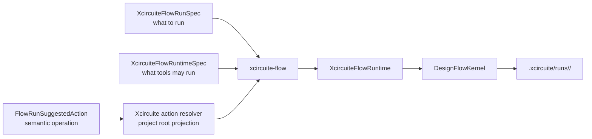
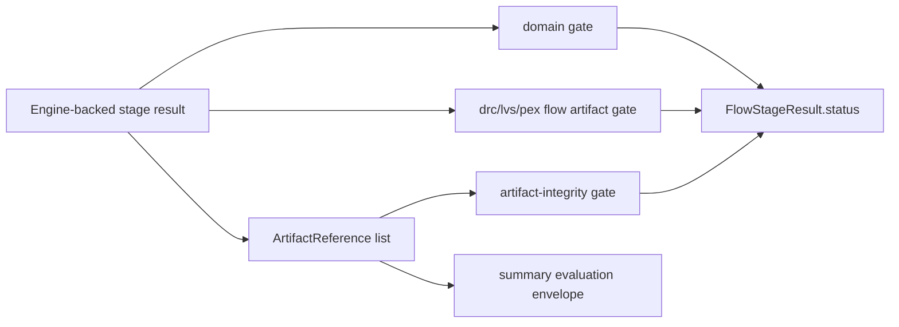

# Xcircuite Flow Runtime Schema

This document defines the versioned JSON contracts consumed by `xcircuite-flow`.
The schema is intentionally explicit because Agent / CLI / CI callers must be
able to run the same flow without reading Swift source or driving the UI.

Current schema versions: `XcircuiteFlowRunSpec` is `1` and
`XcircuiteFlowRuntimeSpec` is `6`.

## Contract Boundary



| Contract | Responsibility |
|---|---|
| `XcircuiteFlowRunSpec` | Run identity, design intent, stage order, stage tool requirements |
| `XcircuiteFlowRuntimeSpec` | Stage executors, optional qualification record references, and toolchain profile |
| `XcircuiteFlowToolSpec` | Optional digest-bound `ArtifactReference` to a ToolQualification-issued record |
| `FlowRunSuggestedAction` | Project-independent semantic operation selected through the shared run ledger; it contains no executable, raw arguments, or workspace path |
| `XcircuiteResolvedSuggestedAction` | Project-bound `xcircuite-flow` command and arguments projected from the semantic operation by Xcircuite |
| `toolchain.json` | Persisted selected/rejected tool decisions for review and replay |

Run ledger reads have two explicit trust boundaries. Human review uses
`FlowRunReviewLedgerLoading` to load structurally validated metadata and then
reports each artifact's integrity independently. Resume, approval, release, and
ordinary ledger mutation use the attested `FlowRunLedgerLoading` boundary and
fail before proceeding when any retained artifact is missing or changed.

`Xcircuite` does not implement verdict logic. Stage executors call engine
packages and adapt their results into `DesignFlowKernel` artifacts.

## Stage Output Artifact Integrity

DRC/LVS/PEX/simulation executors append artifact gates to the persisted
`FlowStageResult` under:

```text
.xcircuite/runs/<run-id>/stages/<stage-id>/result.json
```

`artifact-integrity` verifies each indexed output artifact through
`LocalArtifactVerifier`, including project-relative containment,
symlink containment, SHA-256 digest, and byte count. DRC and LVS stages also add
`drc-artifacts` and `lvs-artifacts` gates. Those gates decode the engine
artifact manifest and verify that every declared output appears in
`FlowStageResult.artifacts`, with matching manifest SHA-256 and byte count when
the engine manifest records them. They also require the manifest producer to
match the canonical execution result producer. Each DRC/LVS stage persists an
immutable `drc-request.json` or `lvs-request.json` containing the verified
input references, followed by a retry-replaceable `drc-execution-result.json`
or `lvs-execution-result.json`. The canonical result, summary, envelope,
manifest, report, and auxiliary outputs retain the backend producer rather
than the Xcircuite tool selector. The producer `build` is the measured
executable SHA-256 used to compare runtime evidence with a
`ToolQualificationScope.binaryDigest`; a missing or different build cannot be
promoted as qualified production evidence. Summary confidence also fails closed
when the retained process qualification is absent, expired, structurally
invalid, or scoped to a different implementation identifier, version, or
binary digest. PEX keeps `pex-artifacts` for
`PEXArtifactCompletenessReport` and adds `pex-flow-artifacts`, which decodes the
persisted PEX manifest and verifies that every available artifact appears in
`FlowStageResult.artifacts`. Simulation does not have an engine artifact
manifest gate yet, but it indexes the persisted netlist input, producer-bound
waveform and measurement outputs, canonical `CoreSpiceSimulationResult`, and
`simulation-summary`, then applies `artifact-integrity` to the complete set.
The canonical result provenance must contain the exact persisted netlist
reference and its producer identifier must match the stage tool ID.

PEX `backendSelection.expectedProducer`, when present, is the exact measured
external-tool identity expected at execution: identifier, semantic version,
and executable SHA-256 in `build`. The backend hashes the executable before and
after use and the stage rejects any observed identity that differs. An omitted
expected producer does not create a default version; the unqualified descriptor
remains ineligible until a qualification record supplies the measured identity.

Each DRC/LVS/PEX/simulation stage writes a summary artifact plus a run-level
`evidence/<summary-artifact-id>-envelope.json` that binds the summary payload to
evaluation spec, observations, confidence, and feedback routing. A stage succeeds
only when its domain gate and artifact gates pass. Simulation envelopes add
measurement value, residual, within-tolerance, missing-measurement, and waveform
variable channels so metric failures can be inspected without reparsing CSV or
free-form diagnostics. PEX envelopes add artifact completeness, failed corner,
aggregate capacitance/resistance, ParasiticIR/SPEF presence, and per-corner
top-net parasitic channels so post-layout planning can inspect extraction
quality and dominant nets without reparsing SPEF or logs. If the domain tool passes but
an artifact path escapes the project, its digest / byte count does not match the
recorded reference, or a DRC/LVS/PEX manifest output is not indexed by the flow
result, the stage fails with typed `ARTIFACT_INTEGRITY_*` or
`ARTIFACT_MANIFEST_*` diagnostics.



## CLI

```bash
xcircuite-flow run \
  --project-root <project-root> \
  --run-spec <run.json> \
  --runtime-config <runtime.json>

xcircuite-flow resume-run \
  --project-root <project-root> \
  --run-id <run-id> \
  --runtime-config <runtime.json>

xcircuite-flow attach-qualification-record \
  --project-root <project-root> \
  --runtime-config <runtime.json> \
  --stage-id <stage-id> \
  --record-reference <qualification-record-reference.json> \
  --out <runtime-with-record.json>

xcircuite-flow validate \
  --run-spec <run.json> \
  --runtime-config <runtime.json>
```

`attach-qualification-record` attaches an `ArtifactReference` for a canonical
`ToolQualificationRecord`. It verifies the record bytes, issuer identity, tool
identity, artifact integrity, and retained ToolQualification decisions before
emitting the runtime config. Xcircuite never derives trust from caller-provided
levels, health strings, or pass/fail labels.

`validate` checks a run spec, runtime config, or both. When both are provided, it
also checks that every run stage has a runtime executor before any run artifacts
are written.

## Path Rules

Paths inside runtime specs are resolved as follows:

| Form | Meaning |
|---|---|
| relative path | Resolved under `--project-root` |
| absolute path | Used as-is |
| empty path | Rejected |
| path containing `..` | Rejected |
| path beginning with `~` | Rejected |

## XcircuiteFlowRunSpec v1

Top-level fields:

| Field | Type | Required | Meaning |
|---|---|---|---|
| `schemaVersion` | integer | yes | Must be `1` |
| `runID` | string | yes | Run directory name; validated before artifact writes |
| `intent` | string | yes | Human/Agent-readable run intent |
| `stages` | array of `FlowStageDefinition` | yes | Ordered flow stages |

Run specs are validated before request construction. The stage list and `intent`
must be non-empty, `runID` and every `stageID` must be valid Xcircuite
identifiers, stage display names must be non-empty, and run stage IDs must be
unique.

`FlowStageDefinition` fields:

| Field | Type | Required | Meaning |
|---|---|---|---|
| `stageID` | string | yes | Stage identifier and stage artifact directory name |
| `displayName` | string | yes | Human-readable stage label |
| `requiredTool` | `ToolTrustRequirement` or null | no | Trust gate requirement before execution |
| `requiresApproval` | boolean | no | Blocks after stage execution until approval exists |
| `retryPolicy` | `FlowStageRetryPolicy` | no | Bounded diagnostic-code retry policy; omitted means disabled |

`FlowStageRetryPolicy` fields:

| Field | Type | Required | Meaning |
|---|---|---|---|
| `maxAttempts` | integer | no | Maximum attempts for the stage; must be at least `1` |
| `retryableDiagnosticCodes` | array of string | no | Stage diagnostic codes that may trigger another attempt |

Retry is owned by `DesignFlowKernel`, but the policy is part of the run spec
because Agent / CLI callers decide which stage diagnostics are worth re-running.
Each attempt is persisted under:

```text
.xcircuite/runs/<run-id>/stages/<stage-id>/attempts.json
```

The attempts artifact records attempt index, max attempts, status, diagnostic
codes, retry decision reason, matched retryable codes, and timestamps. It is
also registered in the run manifest as `<stage-id>-attempts` and appears in
review bundles with role `stage-attempts`. Runtime regressions currently cover
engine-backed retry from `DRC_EXECUTION_ERROR`, `LVS_EXECUTION_ERROR`,
`PEX_EXECUTION_ERROR`, and `SIMULATION_EXECUTION_ERROR` through
`XcircuiteFlowRuntimeTests/runtimeRetriesTransientDRCExecutorFailureAndPersistsAttempts`,
`SignoffFlowStageExecutorTests/lvsExecutorRetriesTransientFailureAndPersistsAttempts`,
`PEXFlowStageExecutorTests/pexExecutorRetriesTransientFailureAndPersistsAttempts`,
and `SimulationFlowStageExecutorTests/simulationExecutorRetriesTransientFailureAndPersistsAttempts`.

`ToolTrustRequirement` fields:

| Field | Type | Required | Meaning |
|---|---|---|---|
| `kind` | string | yes | Tool kind such as `drc`, `lvs`, `pex`, `simulation` |
| `operationID` | string | yes | Capability ID such as `run-drc` |
| `minimumLevel` | string | yes | `unknown`, `smokeChecked`, `corpusChecked`, `oracleChecked`, `productionEligible` |
| `requiredInputFormats` | array of string | no | Format raw values such as `JSON`, `GDSII`, `OASIS`, `SPICE`, `SPEF`, `CSV` |
| `requiredOutputFormats` | array of string | no | Required output formats |
| `requiredEvidenceKinds` | array of string | no | Evidence kinds that must be present |
| `requiredQualifiedEvidenceKinds` | array of string | no | Evidence kinds whose retained canonical result must pass ToolQualification integrity, identity, scope, timestamp, and result-derivation checks |
| `maximumEvidenceAgeSeconds` | number or null | no | Maximum age for required evidence; evidence without `checkedAt` is stale when this is set |
| `requirePassingHealthCheck` | boolean | no | Defaults to true when omitted |

## XcircuiteFlowRuntimeSpec v7

Top-level fields:

| Field | Type | Required | Meaning |
|---|---|---|---|
| `schemaVersion` | integer | yes | Must be `7` |
| `toolchainProfile` | object or null | no | Shared signoff technology/catalog defaults used by DRC/LVS/PEX stages when a stage does not declare its own technology input |
| `executors` | array of executor specs | yes | Stage executor configurations |

Runtime configs are validated before runtime construction and before record
attachment. The executor list must be non-empty, each executor `stageID` must be a
valid Xcircuite stage identifier, and executor stage IDs must be unique. Duplicate
stage IDs are rejected before attachment so a record cannot be attached to
an ambiguous stage.

### DFT execution, oracle correlation, and qualification evidence executors

DFT uses separate tagged executor kinds for native execution and oracle correlation. ToolQualification evidence has its own generic stage:

| Mode | Required fields | Responsibility |
|---|---|---|
| `dftExecution` | stageID, requestPath | Run a typed DFT request and retain the raw DFT result and artifacts |
| `dftOracleCorrelation` | stageID, corpusInput, observationsInput | Correlate retained DFT oracle cases into raw observations |
| `processQualificationEvidenceBuild` | stageID, buildRequestInput | Build process qualification evidence through ToolQualification |

The `processQualificationEvidenceBuild` executor reads a
`ToolProcessQualificationEvidenceBuildRequest` produced from independent,
artifact-backed evidence. It writes `tool-process-qualification-evidence.json`
only after ToolQualification validates all evidence groups, scope, artifact
integrity metadata, independence, and freshness.

DFT stages do not issue release eligibility or own human approval. ReleaseEngine
consumes validated DFT and signoff evidence, while DesignFlowKernel owns
approval, waiver, review, and resume.

### PDK external inspection executors

`pdkStandardView` and `pdkRuleDeck` accept an optional `externalProcess` object.
When it is absent, the local PDKKit inspector is used. When it is present, the
typed Xcircuite process provider is selected after configuration validation.

| Field | Type | Required | Meaning |
|---|---|---|---|
| `stageID` | string | yes | Stable executor stage identifier |
| `manifestInput` | `XcircuiteFlowInputReference` | yes | PDK manifest consumed by the stage |
| `assetID` | string | yes | Manifest asset to inspect |
| `format` | string | `pdkStandardView` only | Requested standard-view format |
| `externalProcess` | object or null | no | External process configuration; null selects the local inspector |

`externalProcess` fields are:

| Field | Type | Required | Meaning |
|---|---|---|---|
| `schemaVersion` | integer | yes | Current value is `2` |
| `executablePath` | absolute string | yes | Executable to launch |
| `arguments` | array of strings | no | Arguments passed in order |
| `redactedArgumentIndexes` | array of integers | no | Unique, sorted argument indexes replaced by `<redacted>` in retained records and provenance |
| `workingDirectoryPath` | string or null | no | Optional process working directory |
| `timeoutSeconds` | positive number | no | Timeout; defaults to `300` |

Arguments may contain only these substitutions: `{{requestPath}}`,
`{{resultPath}}`, `{{projectRoot}}`, `{{runID}}`, and `{{assetID}}`. The process
receives the expanded arguments, while `execution.json` and
`ExecutionProvenance` retain the redacted projection. The provider measures the
resolved executable before execution, invokes that same resolved path, and
fails the run if the executable cannot be reverified or changes before
completion. The process
boundary writes the following immutable raw evidence before the stage envelope
is persisted:

```text
.xcircuite/runs/<run-id>/stages/<stage-id>/raw/external-pdk/
  request.json
  result.json
  stdout.txt
  stderr.txt
  execution.json
```

`execution.json` records the resolved command, timeout, exit status, timestamps
and typed failure diagnostics. A non-zero exit, timeout, cancellation or invalid
result produces structured failed/cancelled evidence and retains the raw files.
The returned envelope then passes through PDKKit's fail-closed schema, run,
asset, format, source-reference and digest checks. Process execution evidence
does not imply ToolQualification or foundry/process qualification.

All six PDK executors (`pdkDiscovery`, `pdkValidation`, `pdkCorpus`,
`pdkStandardView`, `pdkRuleDeck`, and `pdkOracle`) persist their typed result at
`.xcircuite/runs/<run-id>/stages/<stage-id>/raw/pdk-result.json` through the
workspace transaction boundary. The retry-safe artifact carries the exact
`ExecutionProvenance.producer` emitted by PDKKit. The returned stage
artifact, run ledger entry, and run manifest entry therefore identify the same
producer, digest, byte count, and workspace-relative path.

`toolchainProfile` is a run-level technology contract, not an Agent wrapper. It
lets Agent / CI / Human-authored runtime configs pin the PDK/catalog provenance
once and reuse it across signoff stages. Stage-local technology inputs always
take precedence over profile defaults.

Runtime validation treats a present profile as a readiness-gated contract.
`profileID`, `pdkID`, and `technologyCatalogID` must be stable
machine-readable identifiers. Technology references must use safe runtime paths
or typed stage artifact selectors; home-directory expansion, parent traversal,
and invalid stage/artifact IDs are rejected before the runtime is constructed.
When `technologyCatalogPath` is present, `makeRuntime(projectRoot:)` and
`xcircuite-flow validate --project-root <path> --runtime-config <path>` load the
catalog, require an entry matching `technologyCatalogID` and `pdkID`, enforce the
optional `profileIDs` allow-list, and verify every catalog `requiredFiles` path.
Relative required-file paths are resolved from the catalog file directory.
`xcircuite-flow inspect-toolchain-profile --runtime-config <path>
[--project-root <path>]` uses the same readiness validator but returns a JSON
inspection report with `status` `notPresent`, `passed`, or `failed` instead of
throwing for failed readiness.

When a runtime spec carries a profile, Xcircuite persists the exact profile to:

```text
<project-root>/.xcircuite/runs/<run-id>/toolchain-profile.json
```

`DesignFlowKernel` also records a profile summary in:

```text
<project-root>/.xcircuite/runs/<run-id>/toolchain.json
```

The review bundle exposes the full profile artifact with role
`toolchain-profile`, so Human / Agent review can verify which PDK/catalog and
technology defaults were active for DRC/LVS/PEX.

`toolchainProfile` fields:

| Field | Type | Required | Meaning |
|---|---|---|---|
| `profileID` | string or null | no | Stable profile selector for review and provenance |
| `pdkID` | string or null | no | PDK identifier associated with the runtime config |
| `technologyCatalogID` | string or null | no | Technology catalog identifier associated with the runtime config |
| `technologyCatalogPath` | string or null | no | Runtime path to a technology catalog JSON file; when project root is available, readiness validation loads it and verifies matching PDK/catalog entry plus required files |
| `drcTechnologyInput` | `XcircuiteFlowInputReference` or null | no | Default DRC technology input when a `nativeDRC` stage omits `technologyPath` / `technologyInput` |
| `lvsTechnologyInput` | `XcircuiteFlowInputReference` or null | no | Default LVS technology input when a `nativeLVS` stage omits `technologyPath` / `technologyInput` |
| `lvsExtractionArtifacts` | `XcircuiteLVSExtractionArtifacts` or null | no | Default native standard-layout LVS profile input, source deck input, and process profile ID; stage-local values take precedence |
| `pexTechnology` | `XcircuitePEXTechnologySpec` or null | no | Default PEX technology input when a PEX stage omits `technology` |
| `pexTechnologyByCorner` | object of `XcircuitePEXTechnologySpec` | no | Default per-corner PEX technology overrides keyed by declared corner ID |
| `metadata` | object or null | no | Additional string metadata for provenance |

Technology catalog fields:

| Field | Type | Required | Meaning |
|---|---|---|---|
| `schemaVersion` | integer | yes | Must be `1` |
| `entries` | array | yes | PDK/catalog entries available to runtime profiles |

Technology catalog entry fields:

| Field | Type | Required | Meaning |
|---|---|---|---|
| `technologyCatalogID` | string | yes | Catalog identifier that must match `toolchainProfile.technologyCatalogID` |
| `pdkID` | string | yes | PDK identifier that must match `toolchainProfile.pdkID` |
| `profileIDs` | array of string or null | no | Optional allow-list of profile IDs that may use this entry |
| `requiredFiles` | array or null | no | Files that must exist before signoff execution is allowed |
| `metadata` | object or null | no | Additional string metadata for provenance |

Technology catalog required-file fields:

| Field | Type | Required | Meaning |
|---|---|---|---|
| `purpose` | string | yes | Stable identifier for the required file purpose |
| `path` | string | yes | File path; absolute paths are allowed, relative paths resolve from the catalog file directory |
| `description` | string or null | no | Human-readable context for review tools |

Toolchain profile inspection fields:

| Field | Type | Required | Meaning |
|---|---|---|---|
| `schemaVersion` | integer | yes | Must be `1` |
| `status` | string | yes | `notPresent`, `passed`, or `failed` |
| `profilePresent` | boolean | yes | Whether the runtime config carried a `toolchainProfile` |
| `runtimeConfigPath` | string or null | no | Runtime config path used for inspection |
| `projectRootPath` | string or null | no | Project root used for catalog-backed file checks |
| `readinessReport` | object or null | no | Full `XcircuiteFlowToolchainProfileReadinessReport` when a profile is present |

Technology catalog inventory fields:

| Field | Type | Required | Meaning |
|---|---|---|---|
| `schemaVersion` | integer | yes | Must be `1` |
| `projectRootPath` | string or null | no | Project root used to resolve relative catalog paths |
| `pdkRoots` | array | yes | Per-PDK-root discovery status, resolved root path, discovered catalog paths, and issues |
| `discoveredCatalogCount` | integer | yes | Number of catalog paths discovered from PDK roots |
| `catalogCount` | integer | yes | Number of catalog paths inspected |
| `entryCount` | integer | yes | Number of catalog entries decoded |
| `failedPDKRootCount` | integer | yes | Number of requested PDK roots that are invalid, missing, unreadable, or not directories |
| `failedCatalogCount` | integer | yes | Number of catalogs with unreadable files, invalid schema, duplicate entries, or failed entries |
| `failedEntryCount` | integer | yes | Number of entries with invalid identifiers or failed required files |
| `missingRequiredFileCount` | integer | yes | Number of required files that are absent or directories |
| `status` | string | yes | `passed` or `failed` |
| `catalogs` | array | yes | Per-catalog inventory items |
| `issues` | array | yes | Top-level inventory issues, including an empty explicit/discovered catalog set |

`xcircuite-flow inspect-technology-catalog` accepts one or more
`--catalog-path` values. It also accepts `--runtime-config`; when the runtime
config has `toolchainProfile.technologyCatalogPath`, that catalog path is added
to the inventory input and duplicate catalog paths are collapsed while preserving
order. `--pdk-root` values add bounded local discovery for `catalog.json` and
`technology-catalog.json` files that decode as `XcircuiteFlowTechnologyCatalog`.
Relative required files resolve from the catalog directory first, then from the
declared PDK roots. The command returns failed PDK-root, catalog, or
required-file readiness as JSON instead of throwing, so Agent callers can compare
available PDK/catalog entries before selecting a runtime profile.

Executor specs use tagged encoding:

| Field | Type | Required | Meaning |
|---|---|---|---|
| `kind` | string | yes | Executor kind |
| `value` | object | yes | Executor-specific configuration |

Supported `kind` values:

| Kind | Executor | Required value fields |
|---|---|---|
| `logicElaboration` | `LogicElaborationFlowStageExecutor` | `stageID`, `sourceInput`, `topDesignName`, `tool` |
| `powerIntent` | `PowerIntentFlowStageExecutor` | `stageID`, `sourceInput`, `designInput`, `pdkInput`, `topDesignName`, `format`, `tool` |
| `logicLowering` | `LogicLoweringFlowStageExecutor` | `stageID`, `tool`, and either `requestInput` or `designInput` plus `topDesignName` |
| `logicSimulation` | `LogicSimulationFlowStageExecutor` | `stageID`, `tool`, and either `requestInput` or `designInput` plus `pdkInput` and `topDesignName`; optional `stimulusInput`, `seed` |
| `layoutCommand` | `LayoutCommandFlowStageExecutor` | `stageID`, `requestPath`, `tool`; optional `drcExport`, `standardLayoutExports` |
| `nativeDRC` | `DRCFlowStageExecutor` | `stageID`, `layoutPath` or `layoutInput`, `topCell`, `tool` |
| `nativeLVS` | `LVSFlowStageExecutor` | `stageID`, schematic netlist input, `topCell`, `tool` plus exactly one layout input |
| `pex` | `PEXFlowStageExecutor` | `stageID`, `layoutPath` or `layoutInput`, `layoutFormat`, `sourceNetlistPath` or `sourceNetlistInput`, `topCell`, `corners`, `backendSelection`, `tool`, plus `technology` or `toolchainProfile.pexTechnology` |
| `coreSpiceSimulation` | `SimulationFlowStageExecutor` | `stageID`, `netlistInput`, `expectations`, `tool` |
| `postLayoutComparison` | `PostLayoutComparisonFlowStageExecutor` | `stageID`, `preLayoutWaveformPath`, `postLayoutWaveformPath`, `options`, `tool` |
| `rtlVerification` | `RTLVerificationFlowStageExecutor` | `stageID`, `analysis`, `rtlInput`, `pdkInput`, `topModuleName`, `policy`, `frontend`, `proofView`, `assumptions`, `tool`; optional reference, constraint, evidence, and oracle inputs |
| `logicSynthesis` | `LogicSynthesisFlowStageExecutor` | `stageID`, `requestPath`, `tool` |
| `logicEquivalence` | `LogicEquivalenceFlowStageExecutor` | `stageID`, `requestPath`, `tool` |
| `logicEvidenceValidation` | `LogicEvidenceValidationFlowStageExecutor` | `stageID`, `reportPath`, `tool` |
| `dftExecution` | `DFTFlowStageExecutor` | `stageID`, `operation`, `requestPath`, `tool` |
| `dftOracleCorrelation` | `DFTOracleCorrelationFlowStageExecutor` | `stageID`, `corpusInput`, `observationsInput`, `tool` |
| `processQualificationEvidenceBuild` | `ProcessQualificationEvidenceBuilderFlowStageExecutor` | `stageID`, `buildRequestInput`, `tool` |
| `physicalDesign` | `PhysicalDesignFlowStageExecutor` | `stageID`, `requestInput`, non-empty `allowedStages`, `tool` |
| `physicalReview` | `PhysicalDesignReviewFlowStageExecutor` | `stageID`, `manifestInput`, non-empty unique `reviewScope`, `tool` |
| `timingSTA` | `TimingSTAFlowStageExecutor` | `stageID`, typed `inputs`, `tool` |
| `timingSignalIntegrity` | `TimingSIFlowStageExecutor` | `stageID`, typed `inputs`, `tool` |
| `pdkDiscovery` | `PDKDiscoveryFlowStageExecutor` | `stageID`, non-empty `searchRoots`, `tool`; optional `requiredProcessID` |
| `pdkValidation` | `PDKValidationFlowStageExecutor` | `stageID`, `manifestInput`, `requiredAssetRoles`, `validateCrossViews`, `tool` |
| `pdkCorpus` | `PDKCorpusValidationFlowStageExecutor` | `stageID`, `suiteInput`, `rootInput`, `tool` |
| `pdkStandardView` | `PDKStandardViewInspectionFlowStageExecutor` | `stageID`, `manifestInput`, `assetID`, `format`, `tool`; optional external process configuration |
| `pdkRuleDeck` | `PDKRuleDeckInspectionFlowStageExecutor` | `stageID`, `manifestInput`, `assetID`, `tool`; optional external process configuration |
| `pdkOracle` | `PDKOracleFlowStageExecutor` | `stageID`, `manifestInput`, `oracleInput`, `tool` |
| `releaseEvidenceAssembly` | `ReleaseSignoffEvidenceAssemblyFlowStageExecutor` | `stageID`, `requestInput`, `tool` |
| `releaseAuthorization` | `ReleaseAuthorizationFlowStageExecutor` | `stageID`, `requestInput`, `tool` |
| `releaseSignoff` | `ReleaseSignoffFlowStageExecutor` | `stageID`, `requestInput`, `tool` |
| `releaseTapeout` | `ReleaseTapeoutFlowStageExecutor` | `stageID`, `requestInput`, `tool`; optional qualified `geometricXOR` configuration |
| `electricalStandardLayoutImport` | `ElectricalStandardLayoutImportFlowStageExecutor` | `stageID`, digest-bound `layoutInput`, `layoutFormat`, digest-bound `technologyInput`, `technologyFormat`, `tool`; conditional layer map and connectivity inputs |
| `electricalSignoff` | `ElectricalSignoffFlowStageExecutor` | `stageID`, `requestPath`, non-empty unique non-aggregate `axes`, `tool` |
| `electricalSignoffCorpus` | `ElectricalSignoffCorpusFlowStageExecutor` | `stageID`, `specPath`, `tool`; at most one of `oraclePath` and `oracleProcess` |
| `electricalRepairRevision` | `ElectricalSignoffRepairRevisionFlowStageExecutor` | `stageID`, `requestPath`, `tool` |

Schema version 7 has exactly 35 executor discriminators. Each discriminator is
decoded into its typed value, validated, mapped to a tool descriptor, and
constructed through the runtime executor factory. An unknown `kind` fails with
`XcircuiteFlowRuntimeSpecError.unknownExecutorKind`; it is never ignored or
mapped to a default executor.

The design and timing executor kinds are first-class runtime contracts. Agent,
CLI, and CI callers can therefore select the same in-process executors as Swift
API callers. `requestInput`, direct logic inputs, and all timing artifact fields use
`XcircuiteFlowInputReference`; downstream stages should select producer output
with `stageArtifact`, including an `artifactID` or a sufficiently specific
kind/format/path suffix. Resolution reads the producing stage's retained
`result.json` and verifies digest, byte count, and project containment before
the consumer executes. A successful fixture run does not elevate tool or
process qualification.

`releaseTapeout.geometricXOR` binds a canonical process-qualification evidence
artifact, a workspace-relative output report locator, deterministic arguments
and environment, and a finite positive timeout. When it is present, the runtime
constructs `QualifiedGeometricXORExecutor` directly and retains the raw XOR
report and the complete qualification artifact graph in execution provenance
and the foundry handoff. When it is absent, byte identity remains diagnostic
only and tapeout cannot become release-qualified.

Direct logic input mode closes the in-run producer lineage without generating
mutable request files between stages. `logicLowering.designInput` can select the
`logic-design` artifact from `logicElaboration`; `logicSimulation.designInput`
can select `logic-execution-design` from `logicLowering`. Xcircuite reuses the
producer artifact reference, verifies its digest and byte count, and constructs
the engine request with the current run ID. Request-file mode remains available
for independently prepared standalone engine requests, but the two modes are
mutually exclusive and invalid combinations fail validation.

`powerIntent.designInput` can select the same producer-bound `logic-design`
artifact. Its UPF or CPF source and canonical design are both integrity-checked,
and their original producer identities remain attached to parsing provenance and
the resulting stage artifacts.

`pex` is the only serialized PEX executor kind. Its `backendSelection`
identifies a backend registered by `PEXEngine`; unavailable executables or
process material produce typed stage failure evidence. Test extractors are
injected from the test target and do not appear in runtime specifications.

Common executor value fields:

| Field | Type | Required | Meaning |
|---|---|---|---|
| `stageID` | string | yes | Must match a run spec stage when that executor is used |
| `tool` | `XcircuiteFlowToolSpec` | yes | Tool qualification inputs |

Layout-command-specific fields:

| Field | Type | Required | Meaning |
|---|---|---|---|
| `requestPath` | string | yes | JSON `LayoutCommandRequest` input resolved under `--project-root` |
| `drcExport` | object or null | no | Optional DRC-compatible JSON export written from the produced `LayoutDocument` |
| `standardLayoutExports` | array | no | Optional standard mask data exports, such as GDSII/OASIS/CIF/DXF, written from the produced `LayoutDocument`; defaults to empty |

`LayoutCommandFlowStageExecutor` reads the request commands but rewrites the
output paths into the flow-managed raw stage directory:

```text
<project-root>/.xcircuite/runs/<run-id>/stages/<stage-id>/raw/
  layout-command-effective-request.json
  layout-document.json
  drc-layout.json                  # only when drcExport is configured
  <artifact-id>.gds                # only when standardLayoutExports includes GDS
  <artifact-id>.oas                # only when standardLayoutExports includes OASIS
  <artifact-id>.cif                # only when standardLayoutExports includes CIF
  <artifact-id>.dxf                # only when standardLayoutExports includes DXF
  layout-command-result.json
  layout-command-artifact-manifest.json
```

Before indexing, Xcircuite decodes the runner's `EvidenceManifest`, requires the
returned output reference and every declared output producer to match its
execution provenance, and verifies each declared file's byte count and SHA-256.
All accepted locators are then rebuilt through the project boundary as
workspace-relative references while preserving the exact producer. Missing,
duplicate, outside-project, or mismatched evidence fails the stage without a
partial artifact result.

The stage result indexes these verified files as `ArtifactReference`s, so
downstream verification stages can consume produced artifacts without depending
on UI state. DRC consumption is implemented for `drc-layout.json`; LVS
consumption is implemented for GDSII/OASIS/CIF/DXF standard layout exports
through `layoutGDSInput.stageArtifact`; PEX consumption is implemented for
GDSII/OASIS standard layout exports through `layoutInput.stageArtifact`, with
GDSII/OASIS/CIF/DXF generation delegated to `LayoutIO.MaskDataFormatConverter`.

`LayoutCommandResult` schema version 2 carries its output document as
`outputArtifact: ArtifactReference`. Xcircuite verifies its location, semantic
role, kind, format, byte count, digest, and producer through the result and
evidence-manifest boundary.
The removed scalar output path, SHA-256, byte-count, and manifest-path result
fields are not accepted.

Downstream stages should reference these run-scoped files through
`XcircuiteFlowInputReference.stageArtifact`, which reads the producing stage's
`result.json`, selects a single artifact by stable `artifactID` plus optional
metadata, and verifies the recorded SHA-256 before invoking the engine.

Layout-command stage artifacts use these stable IDs:

| Artifact ID | File |
|---|---|
| `layout-command-effective-request` | `layout-command-effective-request.json` |
| `layout-document` | `layout-document.json` |
| `drc-layout` | `drc-layout.json`, only when `drcExport` is configured |
| configured `standardLayoutExports[].artifactID` | standard mask data file, only when configured |
| `layout-command-result` | `layout-command-result.json` |
| `layout-command-manifest` | `layout-command-artifact-manifest.json` |

`drcExport` converts the command-produced `LayoutDocument` into
`NativeDRCLayout` JSON. It is an adapter concern: `LayoutCommands` still owns
layout mutation, and `DRCEngine` still owns rule evaluation. The export supports
rectangular shapes plus via instances whose definitions are provided in
`viaDefinitions`. A via is expanded into a cut-layer rectangle using its center,
cut size, and net ID. Non-rectangular shapes, duplicate via definitions, invalid
via definitions, or via instances without a matching definition fail the stage
before downstream DRC runs.

`drcExport` fields:

| Field | Type | Required | Meaning |
|---|---|---|---|
| `technologyID` | string | yes | Technology identifier persisted into `NativeDRCLayout` provenance |
| `topCell` | string | yes | Layout cell name to export and DRC top cell to declare |
| `unit` | string | no | DRC unit, default `micrometer` |
| `viaDefinitions` | array | no | Definitions used to expand `LayoutVia` records into DRC cut rectangles; defaults to empty for compatibility |
| `rules` | array | yes | `NativeDRCRule` records evaluated by `nativeDRC` |

`viaDefinitions` item fields:

| Field | Type | Required | Meaning |
|---|---|---|---|
| `id` | string | yes | Matches `LayoutVia.viaDefinitionID` |
| `cutLayer` | string | yes | DRC layer name for the emitted cut rectangle |
| `bottomLayer` | string | yes | Lower conductor layer for human/tool review and rule alignment |
| `topLayer` | string | yes | Upper conductor layer for human/tool review and rule alignment |
| `cutWidth` | number | yes | Positive finite cut rectangle width |
| `cutHeight` | number | yes | Positive finite cut rectangle height |

`standardLayoutExports` item fields:

| Field | Type | Required | Meaning |
|---|---|---|---|
| `artifactID` | string | yes | Stable artifact selector used by downstream stages, for example `layout-gds` |
| `format` | string | yes | `gds`, `oasis`, `cif`, or `dxf`; unsupported formats fail the layout-command stage |
| `technologyInput` | `XcircuiteFlowInputReference` | yes | `LayoutTechDatabase` JSON used by `LayoutIO.MaskDataFormatConverter` to map layers and vias |

DRC-specific fields:

| Field | Type | Required | Meaning |
|---|---|---|---|
| `layoutPath` | string | conditional | Project-relative or absolute layout input path. Required when `layoutInput` is absent |
| `layoutInput` | `XcircuiteFlowInputReference` or null | conditional | Typed input reference. Required when `layoutPath` is absent |
| `layoutFormat` | string or null | no | DRC layout format when not inferred |
| `topCell` | string | yes | Top cell name |
| `technologyPath` | string or null | no | Technology/rule input; takes precedence over `toolchainProfile.drcTechnologyInput` |
| `technologyInput` | `XcircuiteFlowInputReference` or null | no | Typed technology input reference; takes precedence over `technologyPath` and `toolchainProfile.drcTechnologyInput` |
| `options` | object or null | no | DRC engine options |

DRC stage results index the full engine report, engine artifact manifest, optional
log, and a compact Agent-readable summary artifact:

| Artifact ID | File | Meaning |
|---|---|---|
| `drc-summary` | `drc-summary.json` | `DRCRunSummaryReport` with pass/fail status, active/waived violation counts, waiver leftovers, and grouped DRC violation buckets |

DRC stages also persist `evidence/drc-summary-envelope.json` with role
`drc-summary`. The envelope evaluates `drc-gate-status`,
`drc-active-violation-count`, `drc-unused-waiver-count`, and each grouped
violation bucket through per-rule channels:

| Channel family | Meaning |
|---|---|
| `drc-active-violation-count` | Total non-waived DRC error count; accepted only at `0` |
| `drc-waived-violation-count` | Waived DRC error count retained for Human review |
| `drc-violation-bucket-count` | Number of grouped rule/kind/layer buckets |
| `drc-rule-<index>-<rule>-active-count` | Active count for one grouped DRC bucket |
| `drc-rule-<index>-<rule>-suggested-fixes` | Engine-owned repair hints for the bucket when available |
| `drc-tool-evidence-count` / `drc-qualified-calibration` | Explicit missing / uncalibrated tool-evidence channels |

Failed active buckets emit `FlowFeedbackSignal` records routed to
`localSurface` with `inspect-drc-violation`, `generate-planning-problem`, and
`apply-drc-repair-hint` suggested actions. If a DRC run fails without active
violation buckets, feedback is routed to `structureMapping` so Agent review can
inspect the run summary and log before planning edits.

`XcircuiteFlowInputReference` uses tagged encoding:

| Kind | Value | Resolution |
|---|---|---|
| `path` | string | Resolved like the legacy path fields under `--project-root`, with absolute paths still accepted |
| `stageArtifact` | object with `stageID` plus optional `artifactID`, `kind`, `format`, `pathSuffix` | Reads `<run-directory>/stages/<stageID>/result.json`, requires exactly one matching artifact, resolves the recorded project-relative path, and verifies `sha256` |
| `stageRawArtifact` | object with `stageID`, `relativePath` | Lower-level escape hatch resolved at stage execution time to `<run-directory>/stages/<stageID>/raw/<relativePath>` |

`stageRawArtifact.relativePath` must be relative and must not contain empty path
segments or parent-directory traversal. The executor checks that the resolved
input exists before invoking the engine.

`stageArtifact.artifactID`, when present, is validated as an Xcircuite artifact
identifier and should be the preferred selector for stage-to-stage contracts.
`kind`, `format`, and `pathSuffix` can further narrow or validate the match.
`stageArtifact.pathSuffix`, when present, follows the same relative path segment
rules. `stageArtifact` requires the selected `ArtifactReference` to carry a
SHA-256 digest; digest mismatch is a stage failure before the downstream engine is
invoked.

LVS-specific fields:

| Field | Type | Required | Meaning |
|---|---|---|---|
| `layoutNetlistPath` | string or null | conditional | Layout netlist input |
| `layoutNetlistInput` | `XcircuiteFlowInputReference` or null | conditional | Typed layout netlist input reference |
| `layoutGDSPath` | string or null | conditional | GDS layout input |
| `layoutGDSInput` | `XcircuiteFlowInputReference` or null | conditional | Typed standard layout input reference; use this with `stageArtifact` for command-produced GDS/OASIS/CIF/DXF artifacts |
| `layoutFormat` | string or null | no | LVS layout format when not inferred |
| `schematicNetlistPath` | string or null | conditional | Reference schematic netlist |
| `schematicNetlistInput` | `XcircuiteFlowInputReference` or null | conditional | Typed schematic netlist input reference |
| `topCell` | string | yes | Top cell name |
| `technologyPath` | string or null | no | Technology/extraction input; takes precedence over `toolchainProfile.lvsTechnologyInput` |
| `technologyInput` | `XcircuiteFlowInputReference` or null | no | Typed technology input reference; takes precedence over `technologyPath` and `toolchainProfile.lvsTechnologyInput` |
| `extractionProfilePath` | string or null | conditional | Versioned layout extraction profile for standard-layout LVS |
| `extractionProfileInput` | `XcircuiteFlowInputReference` or null | conditional | Typed extraction profile input; takes precedence over `extractionProfilePath` and the toolchain profile |
| `extractionDeckPath` | string or null | conditional | Source extraction deck whose SHA-256 digest is bound by the profile |
| `extractionDeckInput` | `XcircuiteFlowInputReference` or null | conditional | Typed source deck input; takes precedence over `extractionDeckPath` and the toolchain profile |
| `processProfileID` | string or null | conditional | Expected process profile identity for standard-layout extraction |
| `options` | object or null | no | LVS engine options |

Exactly one LVS layout input must be provided across `layoutNetlistPath`,
`layoutNetlistInput`, `layoutGDSPath`, and `layoutGDSInput`. Exactly one
schematic input must be provided across `schematicNetlistPath` and
`schematicNetlistInput`. `technologyPath` and `technologyInput` are mutually
exclusive. A standard-layout input additionally requires one extraction profile,
one source deck, and a process profile ID, either on the stage or through
`toolchainProfile.lvsExtractionArtifacts`. Profile and deck path/input pairs are
mutually exclusive. The native backend rejects missing, malformed, mismatched, or
digest-invalid extraction artifacts before layout extraction.

LVS stage results index the full engine report, engine artifact manifest,
optional log, optional extracted layout netlist, and a compact Agent-readable
summary artifact:

| Artifact ID | File | Meaning |
|---|---|---|
| `lvs-summary` | `lvs-summary.json` | `LVSRunSummaryReport` with pass/fail status, active/waived mismatch counts, waiver leftovers, extracted netlist path, and grouped LVS mismatch buckets |

LVS stages also persist `evidence/lvs-summary-envelope.json` with role
`lvs-summary`. The envelope evaluates `lvs-gate-status`,
`lvs-active-mismatch-count`, `lvs-unused-waiver-count`, and each grouped mismatch
bucket through per-bucket channels:

| Channel family | Meaning |
|---|---|
| `lvs-active-mismatch-count` | Total non-waived LVS error count; accepted only at `0` |
| `lvs-waived-mismatch-count` | Waived LVS error count retained for Human review |
| `lvs-mismatch-bucket-count` | Number of grouped rule/category/component buckets |
| `lvs-mismatch-<index>-<rule>-active-count` | Active count for one grouped LVS mismatch bucket |
| `lvs-mismatch-<index>-<rule>-layout-count` / `schematic-count` | Layout-vs-schematic cardinality evidence when available |
| `lvs-mismatch-<index>-<rule>-suggested-fixes` | Engine-owned repair hints for the bucket when available |
| `lvs-device-policy-*` | Device-policy application status and applied / ignored / unobserved rule counts when policy evidence exists |
| `lvs-tool-evidence-count` / `lvs-qualified-calibration` | Explicit missing / uncalibrated tool-evidence channels |

Failed active buckets emit `FlowFeedbackSignal` records. Local model,
parameter, port, and count mismatches route to `localSurface`; policy,
equivalence, or blackbox-related mismatches route to `structureMapping` so Agent
planning can choose between netlist/layout edits and policy repair.

PEX-specific fields:

| Field | Type | Required | Meaning |
|---|---|---|---|
| `layoutPath` | string | conditional | Project-relative or absolute standard layout input path. Required when `layoutInput` is absent |
| `layoutInput` | `XcircuiteFlowInputReference` or null | conditional | Typed standard layout input reference; use this with `stageArtifact` for command-produced GDS/OASIS/CIF/DXF artifacts |
| `layoutFormat` | string | yes | PEX layout format, such as `gds` |
| `sourceNetlistPath` | string | conditional | Project-relative or absolute source netlist path. Required when `sourceNetlistInput` is absent |
| `sourceNetlistInput` | `XcircuiteFlowInputReference` or null | conditional | Typed source netlist input reference |
| `sourceNetlistFormat` | string | no | Source netlist format, default `spice` |
| `topCell` | string | yes | Top cell name |
| `corners` | array | yes | PEX corner definitions |
| `technology` | `XcircuitePEXTechnologySpec` or null | conditional | Base PEX technology input; supports `jsonFile`, `inline`, and `input`. Required when `toolchainProfile.pexTechnology` is absent |
| `technologyByCorner` | object of `XcircuitePEXTechnologySpec` | no | Per-corner technology overrides keyed by an exact declared corner ID; stage-local values override toolchain-profile values |
| `processProfile` | `PEXProcessProfileReference` or null | no | Optional Magic/process profile; relative PDK root and deck paths resolve against the project root, including distinct corner decks |
| `options` | object or null | no | PEX engine options |

Exactly one PEX layout input must be provided across `layoutPath` and
`layoutInput`. Exactly one source netlist input must be provided across
`sourceNetlistPath` and `sourceNetlistInput`. PEX technology must be supplied by
the stage-local `technology` field or by `toolchainProfile.pexTechnology`.
Per-corner process overrides may be supplied with `technologyByCorner` or
`toolchainProfile.pexTechnologyByCorner`; these are carried into
`PEXRunRequest.technologyByCorner` and captured as immutable run inputs.
When a backend needs explicit process decks, `processProfile.cornerDeckPaths`
is resolved against the project root and carried into
`PEXRunRequest.processProfile`.
`technology.input` and `toolchainProfile.pexTechnology.input` are resolved with
the same `XcircuiteFlowInputReference` contract, so a flow can pass technology
JSON from a project file or a prior stage artifact without changing the PEX
executor surface. Stage-local `technology` takes precedence over the profile
default.

PEX stage results index the engine manifest, emitted raw parasitic artifacts,
ParasiticIR JSON, and an Agent-readable summary artifact:

| Artifact ID | File | Meaning |
|---|---|---|
| `pex-summary` | `pex-summary.json` | `PEXRunSummaryReport` with per-corner top parasitic nets and artifact completeness status |

`pex-summary` is generated from the persisted PEX manifest and IR artifacts after
the engine run. It is a flow artifact, not a separate PEX verdict: gate decisions
still come from `PEXRunResult.status` and `PEXArtifactCompletenessReport`.
The companion `evidence/pex-summary-envelope.json` stores channels including
`pex-artifact-completeness-status`, `pex-failed-corner-count`,
`pex-total-capacitance-f`, `pex-total-resistance-ohm`,
`pex-multi-corner-comparison-basis`,
`pex-corner-<index>-<corner>-parasitic-ir-present`, and
`pex-corner-<index>-<corner>-top-net-<index>-<net>-total-capacitance-f`.
Artifact/completeness gaps produce `structureMapping` feedback, while dominant
top-net signals are `localSurface` evidence for post-layout metric comparison.
The optional evaluation criterion
`pex-multi-corner-shared-technology` is rejected when the basis is
`perCornerTechnology` or `unknown`; this does not fail ordinary PEX readiness,
but emits a warning that foundry correlation evidence is required before using
the spread as a PVT signoff claim. Even `sharedTechnology` is a scope signal,
not proof of foundry qualification.

## XcircuiteFlowToolSpec

| Field | Type | Required | Meaning |
|---|---|---|---|
| `qualificationRecord` | `ArtifactReference` or null | no | ToolQualification-issued canonical record reference |

When the field is absent, Xcircuite constructs the tool binding with level
`unknown` and health `notChecked`. When present, ToolQualification validates the
record and returns its descriptor and health. Xcircuite only orchestrates that
issued result and cannot manufacture a trust decision.

## Qualified Evidence Gate

If a run stage declares:

```json
{
  "requiredQualifiedEvidenceKinds": ["corpus"],
  "maximumEvidenceAgeSeconds": 4102444800
}
```

then the validated `ToolQualificationRecord` must supply a descriptor containing
at least one `ToolEvidence` with:

```json
{
  "kind": "corpus",
  "artifact": {
    "id": "corpus-result",
    "locator": {
      "location": { "storage": "workspaceRelative", "value": "qualification/corpus.json" },
      "role": "output",
      "kind": "evidence",
      "format": "json"
    },
    "digest": { "algorithm": "sha256", "hexadecimalValue": "<64 lowercase hexadecimal characters>" },
    "byteCount": 1,
    "producer": { "kind": "engine", "identifier": "qualification-runner", "version": "1" }
  },
  "checkedAt": "<ISO 8601 timestamp>"
}
```

The referenced bytes must decode canonically as a passing
`ToolCorpusQualificationResult` for the selected tool and must carry the same
issuer and timestamp. A structurally valid reference alone is insufficient.

Otherwise the flow blocks at the `tool-trust` gate and writes the rejected
decision to:

```text
<project-root>/.xcircuite/runs/<run-id>/toolchain.json
```

## Contract Fixtures

Committed fixtures:

| Fixture | Purpose |
|---|---|
| `Tests/XcircuiteTests/Fixtures/FlowRuntime/qualified-evidence-run.json` | Run spec requiring qualified corpus evidence within a maximum age |
| `Tests/XcircuiteTests/Fixtures/FlowRuntime/qualified-signoff-run.json` | DRC/LVS/PEX run spec requiring qualified corpus evidence |

Regression:

```bash
xcodebuild -scheme Xcircuite-Package -destination 'platform=macOS' \
  -only-testing:XcircuiteTests/XcircuiteQualificationRecordIntegrationTests \
  -test-timeouts-enabled YES -maximum-test-execution-time-allowance 60 test
```

This regression decodes the committed run requirements, issues a canonical
`ToolQualificationRecord`, creates its digest-bound `ArtifactReference`, and
executes `attach-qualification-record` through the public CLI boundary.

## Versioning Rule

Each persisted contract owns its schema version. The flow run contract uses
version `1`, while the flow runtime contract uses version `2`. Retained signoff
reports and simulation golden corpus reports use version `2`. Incompatible changes
must increment the owning contract's `schemaVersion`. This development package
does not retain obsolete decoders after fixtures and callers migrate.

### Retained signoff report v2

`XcircuiteRetainedSignoffReport` version 2 stores each external oracle lane's
report as a CircuiteFoundation `ArtifactReference`. The reference identifies a
non-empty JSON report with a SHA-256 digest. Version 1's local
`status` / `path` / `sha256` / `byteCount` object has been removed; producers
emit the canonical artifact identity, locator, semantic role, kind, format,
digest, and byte count directly.

Timing STA and signal-integrity readers pass canonical input references to
`LocalArtifactVerifier`. Invalid locations, missing files, byte-count
mismatches, and digest mismatches fail before TimingEngine receives bytes.
