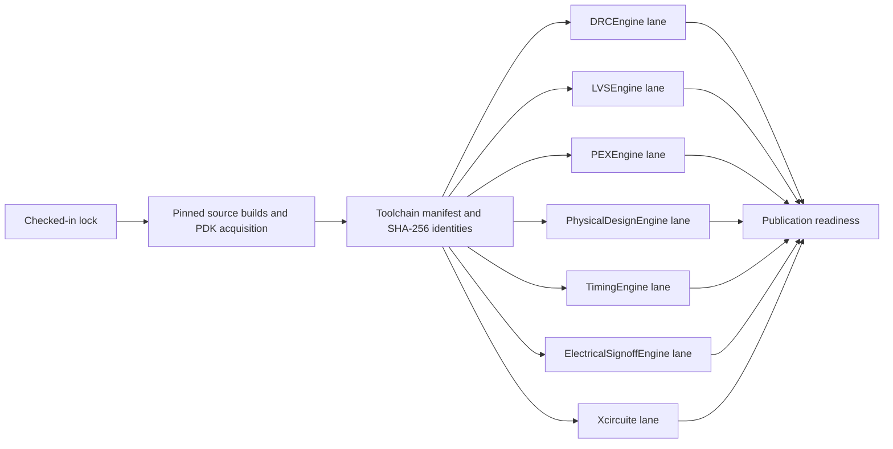

# Hosted Installed-Tool Matrix

## Purpose

This workflow is the publication-readiness gate for external signoff integration. It proves that the packages can execute against installed tools and a pinned process installation on a GitHub-hosted macOS runner. Contract tests, fake executables, and tool-presence checks are not accepted as real-tool evidence.

The workflow belongs to the `Xcircuite` repository because the LSI workspace root is not a Git repository and cannot host GitHub Actions. Each engine remains independently buildable; Xcircuite owns only the cross-package qualification composition and retained evidence.



## Locked identity

[`hosted-installed-tool-lock.json`](../ci-artifacts/contracts/hosted-installed-tool-lock.json) is the only acquisition and lane inventory. It pins full source revisions for Magic, Netgen, OpenROAD/OpenRCX, OpenSTA, and ngspice. It also pins the Volare version, open_pdks revision, real TT/SS/FF corners, PDK assets, package revisions, test filters, and every process timeout.

Each successful toolchain manifest records:

| Identity | Evidence |
|---|---|
| Tool source | Repository and full source revision |
| Installed executable | Relative path, byte count, SHA-256 digest, version output |
| Process | Process name and full open_pdks revision |
| Corners | TT, SS, and FF identifier, classification, voltage, and ngspice model section |
| Per-corner assets | Liberty, OpenRCX rule deck, ngspice model library, byte count, SHA-256 digest |
| Runner | Locked runner image, platform, architecture |

Every package lane extracts the same qualified archive and recomputes all executable and PDK asset digests. Publication readiness is blocked unless every lane reports the same toolchain manifest digest.

## Real execution

The matrix runs a real external oracle before its package tests:

| Lane | Required external execution |
|---|---|
| `drc` | Magic technology load, geometry creation, and DRC |
| `lvs` | Magic DRC and Netgen LVS on independently persisted netlists |
| `pex` | Magic DRC and OpenRCX extraction at TT, SS, and FF |
| `physical-design` | OpenROAD design import and floorplan initialization |
| `timing` | OpenSTA Liberty/netlist load, constraints, and timing report at TT, SS, and FF |
| `electrical-signoff` | ngspice MOS operating point with the locked TT, SS, and FF model sections and checked numeric results |
| `xcircuite` | Every external oracle above, bound to one design identity, followed by end-to-end and release-handoff suites |

The PEX, timing, electrical-signoff, and Xcircuite lanes are blocked unless all locked corner IDs are retained. The canonical corpus identifies one `sky130_fd_sc_hd__buf_1` design through a design contract, logical wrapper netlist, foundry GDS library, foundry SPICE library, and electrical template. A shared identity label alone is not evidence: every oracle records the path, byte count, role, and SHA-256 digest of every file it actually consumed.

| Oracle | Canonical projection and lineage |
|---|---|
| Magic | Reads the locked standard-cell GDS and emits an extracted physical SPICE netlist |
| Netgen | Reads the exact Magic-emitted bytes and the locked standard-cell schematic SPICE bytes |
| OpenROAD / OpenRCX | Read the logical wrapper, LEFs, corner Liberty, and corner extraction rules |
| OpenSTA | Reads the same logical wrapper bytes and the selected corner Liberty bytes |
| ngspice | Reads a generated deck for the same standard cell, the foundry schematic SPICE, and the selected model section |

The finalizer recomputes the canonical corpus digest, checks each oracle's exact required input-role set, compares every canonical/process input digest, verifies the Magic-to-Netgen extracted-netlist lineage, and checks the expected oracle count. A matching `designIdentitySHA256` stamp with different or missing consumed bytes is blocked.

The Xcircuite lane additionally requires the end-to-end design-flow, raw signoff-evidence, and release-handoff test filters; structural package tests alone cannot authorize publication.

After the oracle succeeds, the lane verifies standalone remote package resolution, performs bounded `xcodebuild build-for-testing`, and performs bounded `xcodebuild test-without-building`. An external process failure, timeout, digest mismatch, local package dependency, missing PDK asset or corner, consumed-input mismatch, projection-lineage mismatch, missing release handoff, missing lane, or failed test leaves `status: blocked` evidence and fails the gate.

## Evidence retention

The workflow uploads evidence even when a command fails.

```text
ci-artifacts/hosted-installed-tool-matrix/
  acquisition/
    toolchain-evidence.json
    acquisition-logs/
  lanes/
    <lane>/
      lane-evidence.json
      oracle-inputs/
      oracle-logs/
      resolve-package-dependencies.log
      build-for-testing.log
      test-without-building.log
      test-results.xcresult/
  publication-readiness.json
```

The JSON contracts are defined under [`ci-artifacts/schemas`](../ci-artifacts/schemas). A blocked record contains a stable code, reason, and suggested action. The final gate never converts blocked or missing evidence into a passing result.

## Maintenance rules

1. Update a tool, PDK, corner, deck, package revision, or filter only through the lock file.
2. Keep all revisions as full Git commit identifiers. The Xcircuite lane alone resolves `$GITHUB_SHA` to the triggering checkout.
3. Update the runner, lock, acquisition implementation, and schemas together when an installation contract changes.
4. Preserve real oracle execution when package tests are reorganized. A test double is supplementary evidence only.
5. Do not add repository secrets or machine-local paths. The workflow acquires public inputs into runner-temporary directories.
6. Do not publish from this matrix unless `publication-readiness.json` is `passed`.
