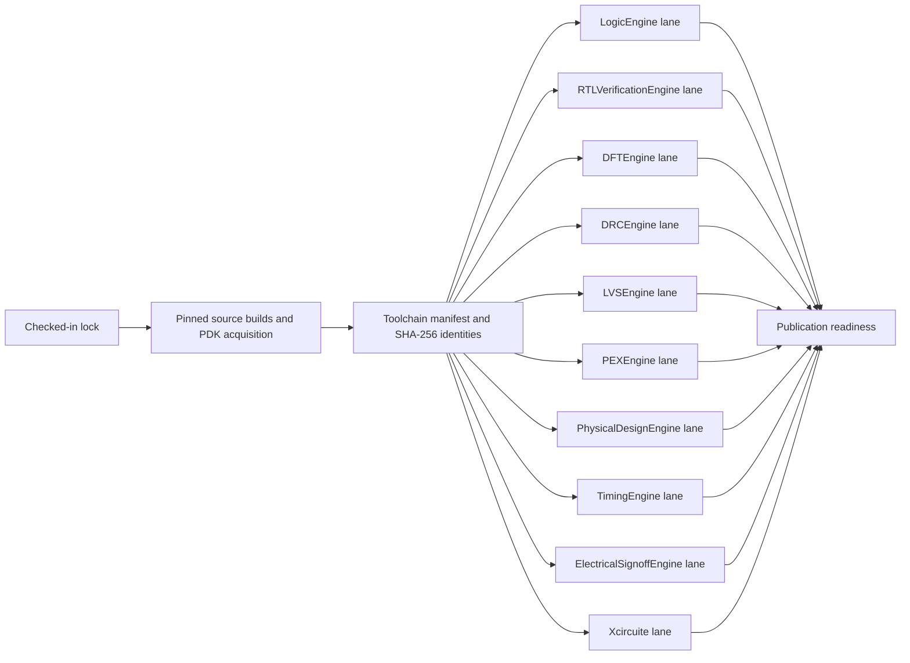

# Hosted Installed-Tool Matrix

## Purpose

This workflow is the publication-readiness gate for external signoff integration. It proves that the packages can execute against installed tools and a pinned process installation on a GitHub-hosted macOS runner. Contract tests, fake executables, and tool-presence checks are not accepted as real-tool evidence.

The workflow belongs to the `Xcircuite` repository because the LSI workspace root is not a Git repository and cannot host GitHub Actions. Each engine remains independently buildable; Xcircuite owns only the cross-package qualification composition and retained evidence.


```mermaid
flowchart LR
    Lock["Checked-in lock"] --> Acquire["Pinned source builds and PDK acquisition"]
    Acquire --> Manifest["Toolchain manifest and SHA-256 identities"]
    Manifest --> Logic["LogicEngine lane"]
    Manifest --> RTL["RTLVerificationEngine lane"]
    Manifest --> DFT["DFTEngine lane"]
    Manifest --> DRC["DRCEngine lane"]
    Manifest --> LVS["LVSEngine lane"]
    Manifest --> PEX["PEXEngine lane"]
    Manifest --> Physical["PhysicalDesignEngine lane"]
    Manifest --> Timing["TimingEngine lane"]
    Manifest --> Electrical["ElectricalSignoffEngine lane"]
    Manifest --> Integration["Xcircuite lane"]
    Logic --> Gate["Publication readiness"]
    RTL --> Gate
    DFT --> Gate
    DRC --> Gate["Publication readiness"]
    LVS --> Gate
    PEX --> Gate
    Physical --> Gate
    Timing --> Gate
    Electrical --> Gate
    Integration --> Gate
```

## Locked identity

[`hosted-installed-tool-lock.json`](../ci-artifacts/contracts/hosted-installed-tool-lock.json) is the only acquisition and lane inventory. It pins full source revisions for Magic, Netgen, OpenROAD/OpenRCX, OpenSTA, ngspice, Yosys, Icarus Verilog, and Verilator. Runtime companions emitted by one source build, including `yosys-abc` and `vvp`, are declared separately and digest-bound without pretending that they are independent source identities. Source-built dependencies are part of the same contract: OpenSTA's CUDD dependency is built from its locked full revision into the qualified prefix, and its installed header and static library are digest-bound in the toolchain manifest. The workflow does not obtain CUDD from an unversioned Homebrew tap. The lock also pins the Volare version, open_pdks revision, real TT/SS/FF corners, PDK assets, package revisions, test filters, and every process timeout.

The process profile also owns the Verilog-model preprocessor contract. The
locked `FUNCTIONAL=1` and empty `UNIT_DELAY=` definitions are copied into the
toolchain manifest and applied consistently by Yosys, Icarus, and Verilator.
Oracle-specific choices such as disabling UDP bodies for synthesis and lint
remain in the oracle implementation rather than being presented as a PDK
property.

OpenROAD is acquired as the headless Tcl/CLI product used by these lanes.
GUI, Python bindings, and upstream tests are excluded from this hosted
realization because no declared oracle consumes them; their transitive runtime
libraries therefore cannot silently become part of the qualified executable
contract.

Each successful toolchain manifest records:

| Identity | Evidence |
|---|---|
| Tool source | Repository and full source revision |
| Source-built dependency | Repository, full source revision, installed artifact path, byte count, and SHA-256 digest |
| Installed executable | Relative path, byte count, SHA-256 digest, version output, and separately identified runtime companions |
| Process | Process name and full open_pdks revision |
| Corners | TT, SS, and FF identifier, classification, voltage, temperature, and ngspice model section |
| Per-corner assets | Liberty, OpenRCX rule deck, ngspice model library, byte count, SHA-256 digest |
| Runner | Locked runner image, platform, architecture |
| Compiler host | Locked `DEVELOPER_DIR`, exact Xcode build output, exact Swift version output, hosted image OS, and hosted image version |

Every package lane extracts the same qualified archive and recomputes all executable, source-built dependency, and PDK asset digests. Two identities remain deliberately separate:

| Identity | Stability contract |
|---|---|
| Profile identity | Canonical digest of the resolved lock, including the triggering Xcircuite revision; equal across clean environments that execute the same profile |
| Realization identity | Canonical digest of the exact host, executable, dependency, and process artifact identities; equal across lanes that consume one acquired archive |

Timestamps, log paths, and temporary roots are excluded from both identities. Executable and process artifact digests remain part of the realization identity. Publication readiness is blocked unless every lane reports one profile identity and one realization identity.

## Real execution

The matrix runs a real external oracle before its package tests:

| Lane | Required external execution |
|---|---|
| `logic` | Yosys elaboration, synthesis, generic equivalence, and PDK mapping plus Icarus compilation and functional simulation |
| `rtl-verification` | Verilator lint and the independent Yosys synthesis/equivalence observation |
| `dft` | OpenROAD scan insertion, DFTEngine canonical import and gate-level ATPG, Yosys functional-mode equivalence, retained STIL conversion, and Icarus golden/fault replay |
| `drc` | Magic technology load, geometry creation, and DRC |
| `lvs` | Magic DRC and Netgen LVS on independently persisted netlists |
| `pex` | Magic DRC and OpenRCX extraction at TT, SS, and FF |
| `physical-design` | OpenROAD design import and floorplan initialization |
| `timing` | OpenSTA Liberty/netlist load, constraints, and timing report at TT, SS, and FF |
| `electrical-signoff` | ngspice MOS operating point with the locked TT, SS, and FF model sections and checked numeric results |
| `xcircuite` | Every external oracle above, bound to one design identity, followed by end-to-end and release-handoff suites |

The PEX, timing, electrical-signoff, and Xcircuite lanes are blocked unless all locked corner IDs are retained. The canonical `sky130A-open-reference-v1` corpus is checked in under `ci-artifacts/corpora` rather than generated by the runner. Its manifest and each source artifact are independently digest-bound by the lock. It identifies one `sky130_fd_sc_hd__buf_1` design through a design contract, logical wrapper netlist, functional testbench, foundry GDS library, foundry SPICE library, foundry Verilog models, and electrical template. A shared identity label alone is not evidence: every oracle records the path, byte count, role, and SHA-256 digest of every file it actually consumed.

The DFT lane uses the separate immutable
`sky130A-open-reference-dft-v1` corpus. It retains the source netlist, scan
constraints, process identity, scan-cell binding manifest, and explicit scan
domain contract. OpenROAD emits the transformed Verilog, DEF `SCANCHAINS`, and
raw log; DFTEngine reopens those exact bytes, composes process-scoped ATPG with
the retained cell/Liberty contracts, retains the fault universe and neutral
execution plan, and converts that plan to STIL. Yosys and Icarus consume the
byte-identical OpenROAD netlist. Publication is blocked unless Yosys proves
functional-mode equivalence and every Icarus fault observation agrees with the
native ATPG outcome. The finalizer also recomputes the exact DFTEngine pipeline
input set: source and transformed netlists, ScanDEF, scan-cell manifest, raw
OpenROAD evidence, SDC, PDK identity, and Liberty bytes.

| Oracle | Canonical projection and lineage |
|---|---|
| Magic | Reads the locked standard-cell GDS and emits an extracted physical SPICE netlist |
| Netgen | Reads the exact Magic-emitted bytes and the locked standard-cell schematic SPICE bytes |
| OpenROAD / OpenRCX | Read the logical wrapper, LEFs, corner Liberty, and corner extraction rules |
| OpenSTA | Reads the same logical wrapper bytes and the selected corner Liberty bytes |
| ngspice | Reads a generated deck for the same standard cell, the foundry schematic SPICE, and the selected model section |
| Yosys | Reads the same logical wrapper, foundry Verilog models, process-owned model definitions, and TT Liberty; disables UDP bodies for the current combinational corpus, retains synthesized and mapped netlists, and fails on an unproved generic equivalence point |
| Icarus | Compiles the checked-in functional testbench with the exact logical wrapper, foundry Verilog model bytes, and process-owned model definitions, then executes the retained simulation image with `vvp` |
| Verilator | Lints the exact logical wrapper and foundry Verilog model bytes with the process-owned definitions and UDP bodies disabled for the current combinational corpus |
| OpenROAD DFT | Reads the DFT source plus locked LEF/Liberty bytes and emits the retained scan netlist and DEF `SCANCHAINS` |
| Yosys DFT | Proves the source and scan-inserted design equivalent with scan enable inactive |
| Icarus DFT | Replays retained STIL against the exact scan netlist and foundry model bytes, including fault-by-fault correlation |

The logic, RTL-verification, and DFT lanes retain raw external-tool evidence;
they do not issue a production trust verdict. CDC/RDC provider evidence,
negative DFT corpus executions, and independent ToolQualification decisions
remain mandatory before the corresponding release axes can become production
eligible.

The finalizer recomputes the canonical corpus digest, checks each oracle's exact required input-role set, compares every canonical/process input digest, verifies the Magic-to-Netgen extracted-netlist lineage, and checks the expected oracle count. A matching `designIdentitySHA256` stamp with different or missing consumed bytes is blocked.

The Xcircuite lane additionally requires the end-to-end design-flow, raw signoff-evidence, and release-handoff test filters; structural package tests alone cannot authorize publication.

After the oracle succeeds, the lane verifies standalone remote package resolution, performs bounded `xcodebuild build-for-testing`, and performs bounded `xcodebuild test-without-building`. An external process failure, timeout, digest mismatch, local package dependency, missing PDK asset or corner, consumed-input mismatch, projection-lineage mismatch, missing release handoff, missing lane, or failed test leaves `status: blocked` evidence and fails the gate.

## Evidence retention

The initial execution-derived acquisition failures and their corrective
commits are retained in
[`hosted-installed-tool-matrix-baseline.md`](hosted-installed-tool-matrix-baseline.md).

The workflow uploads evidence even when a command fails.

```text
ci-artifacts/hosted-installed-tool-matrix/
  acquisition/
    toolchain-evidence.json
    acquisition-logs/
  lanes/
    <lane>/
      lane-evidence.json
      oracle-inputs/
      oracle-logs/
      resolve-package-dependencies.log
      build-for-testing.log
      test-without-building.log
      test-results.xcresult/
  publication-readiness.json
```

The JSON contracts are defined under [`ci-artifacts/schemas`](../ci-artifacts/schemas). A blocked record contains a stable code, reason, and suggested action. The final gate never converts blocked or missing evidence into a passing result.

## Maintenance rules

1. Update a tool, PDK, corner, deck, package revision, or filter only through the lock file.
2. Keep all revisions as full Git commit identifiers. The Xcircuite lane alone resolves `$GITHUB_SHA` to the triggering checkout.
3. Update the runner, locked `DEVELOPER_DIR`, lock, acquisition implementation, and schemas together when an installation contract changes. A newer Xcode is a new qualification identity, not an implicit fallback.
4. Preserve real oracle execution when package tests are reorganized. A test double is supplementary evidence only.
5. Do not add repository secrets or machine-local paths. The workflow acquires public inputs into runner-temporary directories.
6. Do not publish from this matrix unless `publication-readiness.json` is `passed`.
