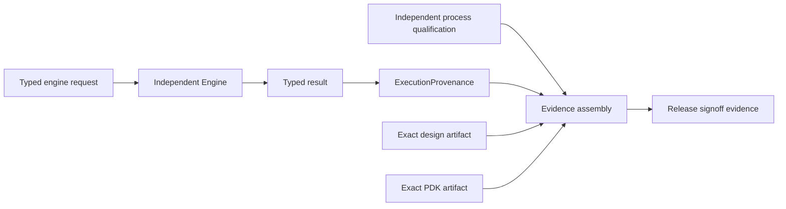

# Release Signoff Evidence Assembly

`ReleaseSignoffEvidenceAssemblyFlowStageExecutor` converts typed domain results into
`ReleaseSignoffEvidenceReference` values consumed by `ReleaseEngine`. It does not infer a
pass from a stage status, a file name, or untyped JSON.

## Evidence path

Each source separates `executionInputs`, `derivedInputs`, `rawEvidence`, and
`qualificationEvidence`, and also declares a `requestArtifact`, `resultArtifact`, and an
independently retained `qualificationArtifact`. DRC and LVS additionally identify the
exact manifest and report references; PEX identifies its exact manifest. The assembler
never assigns meaning from a file name, a basename, or artifact ordering.

## Required bindings

The assembler rejects the source unless all of these bindings hold:

| Binding | Requirement |
|---|---|
| Result schema | The result decodes as the producer-specific result type for the selected axis |
| Request schema | The request decodes as the matching producer-specific request type |
| Run | Request, result, assembly request, and flow context use the same run ID |
| Inputs | Typed request inputs and `ExecutionProvenance.inputs` are exactly equal |
| Design and PDK | Provenance contains the same immutable location, kind, format, digest, byte count, and producer as the release design and PDK; local artifact IDs and input/output roles may differ |
| Producer | Result artifact producer equals `ExecutionProvenance.producer` |
| Qualified implementation | A provenance identity exactly matches the qualification scope implementation ID, version, and executable SHA-256 in `ProducerIdentity.build` |
| Time | Execution completion is not later than evidence evaluation |
| Category integrity | Execution inputs, derived inputs, raw evidence, and qualification evidence are disjoint and contain no duplicate reference |
| Input identity | The union of declared execution and derived inputs exactly equals the full `ArtifactReference` set in execution provenance |
| Raw evidence | DRC/LVS manifests and reports, the PEX manifest and outputs, and timing outputs exactly match the canonical engine result |
| Integrity | Every referenced request, result, categorized evidence, qualification, design, and PDK artifact is re-read by digest and byte count |

Qualification corpus inputs and outputs remain independent qualification evidence. They
are not required to contain an operational design run result. This avoids a circular
contract in which a tool would need to be qualified against a result that does not exist
until after qualification.

## Producer mapping

| Producer | Accepted release axes | Typed request and result |
|---|---|---|
| `logicSimulation` | simulation | `LogicSimulationRequest`, `LogicSimulationResult` |
| `logicSynthesisEquivalence` | synthesis equivalence | `LogicSynthesisEquivalenceRequest`, `LogicSynthesisEquivalenceEvidence` |
| `rtlVerification` | lint, CDC, RDC, formal proof | `RTLVerificationRequest`, `RTLVerificationResult` |
| `dft` | scan insertion, ATPG, BIST | `DFTRequest`, `DFTResult` |
| `powerIntent` | power intent | `PowerIntentParsingRequest`, `PowerIntentParsingResult` |
| `staticTiming` | static timing | `STARequest`, `STAExecutionResult` |
| `signalIntegrity` | crosstalk | `SignalIntegrityRequest`, `SignalIntegrityExecutionResult` |
| `designRuleCheck` | DRC, antenna | `DRCRequest`, `DRCExecutionResult` |
| `layoutVersusSchematic` | LVS | `LVSRequest`, `LVSExecutionResult` |
| `parasiticExtraction` | PEX | `PEXRunRequest`, `PEXRunResult` |
| `physicalDesign` | density, metal fill, physical DFM | `PhysicalDesignRequest`, `PhysicalDesignResult` |
| `electricalSignoff` | EM, IR drop, ERC, ESD, latch-up, aging | `ElectricalSignoffRequest`, `ElectricalSignoffRunResult` |

A missing, expired, invalid, or mismatched qualification blocks assembly. It never creates
a passing record. The assembled records artifact is immutable; an identical retry is
idempotent and different bytes at the same location are rejected. The assembly,
signoff, authorization, and tapeout executors also retain the normalized request
JSON as an immutable input artifact. Their persisted result provenance references
that exact request artifact, closing the versioned-spec-to-ledger audit path.
